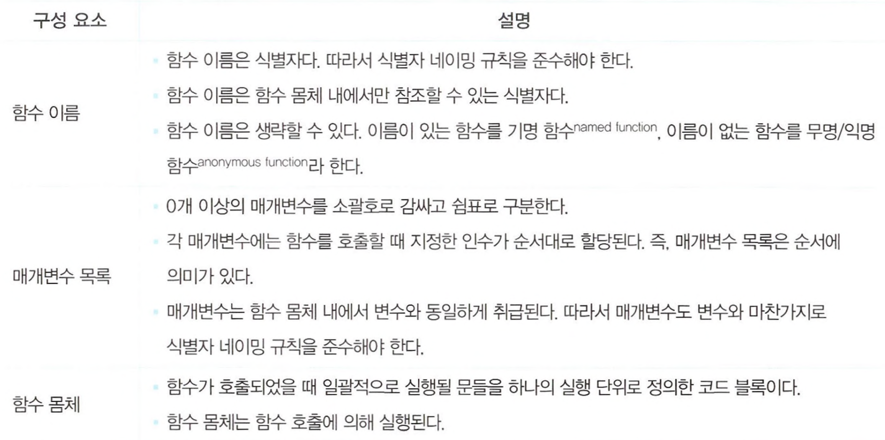

# 12장 함수

## 함수란?

일련의 과정을 문으로 구현하고 코드블록으로 감싸서 하나의 실행 단위로 정의한 것

- 전달받는 변수 : 매개변수
- 입력 : 인수
- 출력 : 반환값


## 함수를 사용하는 이유

- 코드의 재사용
- 유지보수의 편의성
- 코드의 신뢰성
- 코드의 가독성

## 함수 리터럴

**리터럴** : 프로그래밍에서 자료를 표기하는 방식

**예시**

```jsx
var f = function add(x, y) {
  return x + y;
};
```

**구성요소**


> 함수는 객체지만 일반 객체와 다르게 `호출` 할 수 있다

## 함수 정의

**4가지 방식**


### 함수 선언문

```jsx
function add(x, y) {
  return x + y;
}
```

> 함수리터럴과 형태가 동일하지만 함수리터럴은 함수를 생략할 수 있지만 함수 선언문은 함수 이름을 생략할 수 없다.

> 함수선언문은 '표현식'이 아닌 '문' 이라 실행하면 'undefined'를 출력한다.

```jsx
//기명 함수 리터럴은 단독으로 사용하면 함수 선언문으로 해석됨
//함수이름 생략 불가
function foo() {
  console.log("foo");
}
foo();

//함수 리터럴을 피연산자로 이용하면, 함수 리터럴 표현식으로 해석됨
//함수이름 생략가능
(function bar() {
  console.log("bar");
});
bar();
//-> referenceError 남
```

- 표현식이 아닌 함수 선언문은 피연산자로 사용할 수 없다.

- 함수리터럴 표현식으로 생성된 bar는 호출할 수 없다.  
  함수리터럴에서 `함수 이름`은 **함수 몸체 내에서만 참조할 수 있는 식별자**로 함수 몸체 외부에서는 참조할 수 없기 때문이다.

> 그렇다면 함수선언문은 왜 함수이름으로 호출가능한가?  
> -> 자바스크립트 엔진은 생성된 함수를 호출하기 위해 함수 이름과 동일한 이름의 식별자를 암묵적으로 생성하고, 거기에 함수 객체를 할당 하기 때문이다.  
> **함수이름이 아니라 식별자로 호출하는 것.**

### 함수표현식

자바스크립트의 함수는 객체 타입의 값으로, 변수에 할당할 수 도 있고 프로퍼티 값이 될 수도 있으며 배열의 요소가 될 수도 있다.

**일급객체** : 값의 성질의 갖는 객체

- 자바스크립트의 함수는 `일급객체`이다.
- 함수는 일급객체이므로 변수에 할당가능하다.
- 객체를 변수에 할당하는 함수 정의 방식을 **함수 표현식**이라 한다.

```jsx
var add = function (x, y) {
  return x + y;
};

//기명 함수 표현식
var add = function foo(x, y) {
  return x + y;
};
add(2, 5);
//정상적으로 호출

foo(2, 5);
//referenceError
```

> 함수 선언문과 함수 표현식은 유사하게 동작하는것처럼 보이지만 정확히 동일하게 동작하지는 않는다.

> 함수선언문 - '표현식이 아닌문'  
> 함수표현식 - '표현식인 문'

### 함수 생성 시점과 함수 호이스팅

```jsx
add(2, 5); // 7
sub(2, 5); // TypeError: sub is not a function
```

- **함수 선언문**으로 정의한 함수는 함수 선언문 이전에 호출할 수 있다.
- **함수 표현식**으로 정의한 함수는 함수 표현식 이전에 호출할 수 없다.
- 두 정의방식은 생성 시점이 다르다.
- 모든 선언문과 같게 함수 선언문도 런타임 이전에 자바스크립트 엔진에 의해 먼저 실행된다.

> **함수호이스팅** : 함수 선언문이 코드의 선두로 끌어올려진 것처럼 동작하는 자바스크립트 고유의 특징

> 함수표현식은 변수에 할당되는 값이 함수 리터럴인 문으로 변수선언은 런타임 이전에 실행되어 'undefined'로 초기화 되지만 값은 할당문이 실행되는 시점에 평가되므로 **변수호이스팅**이 발생한다.

### Funcion 생성자 함수

자바스크립트가 기본 제공하는 빌트인 함수

```jsx
var add = new Function("x", "y", "return x + y");
add(2, 5); // 7
```

- 일반적이지 않으며 바람직하지도 않다.

### 화살표 함수

화살표 함수는 항상 익명함수로 정의한다.

```jsx
const add = (x, y) => x + y;
add(2, 5); // 7
```

- 기존함수와 this 바인딩 방식이 다르다
- prototype 프로퍼티가 없다.
- arguments 객체를 생성하지 않는다.

## 함수 호출

### 매개변수와 인수

- 매개변수는 함수를 정의할 때 선언하며, 함수 몸체 내부에서 변수와 동일하게 취급된다.
- 매개변수는 함수 몸체 내부에서만 참조할 수 있고, 함수 몸체 외부에서는 참조할 수 없다. (매개변수의 스코프는 함수 내부)
- 매개변수의 개수와 인수의 개수가 달라도 에러가 발생하지 않는다.
- 매개변수보다 인수가 더 많은 경우는 무시된다.
- 초과된 인수는 버려지는 것이 아니라 arguments 객체의 프로퍼티로 보관된다.

### 인수확인

```jsx
function add(x, y) {
  return x + y;
}

console.log(add(2)); //NaN
console.log(add("a", "b")); //'ab'
```

- 매개변수와 인수의 개수가 일치하는지 확인하지 않는다
- 자바스크립트는 동적 타입 언어로 매개변수 타입을 사전에 지정할 수 없다.

> arguments 객체를 통해 인수개수를 확인하거나, 단축평가, 매개변수 기본값을 사용하면 인수체크 및 초기화가 가능하다.

### 매개변수의 최대 개수

매개변수의 최대 개수에 대해 명시적으로 제한하고 있지 않지만  
함수는 한가지 일만 해야하며 가급적 작게 만들어야한다.

### 반환문

- 반환문은 함수의 실행을 중단하고, 함수 몸체를 빠져나간다.
- return 키워드 뒤에 오는 표현식을 평가해 반환한다. 명시적으로 지정하지 않으면 undefined가 반환된다.
- 반환문을 생략될 수 있다.
- 반환문은 몸체 내부에서만 사용할 수 있다.

## 참조에 의한 전달과 외부 상태의 변경

```jsx
function changeVal(primitive, obj) {
  primitive += 100;
  obj.name = "Kim";
}

// 외부 상태
var num = 100;
var person = { name: "Lee" };

changeVal(num, person);

//원시값은 원본이 훼손되지 않는다
console.log(num); //100
//객체는 원본이 훼손된다.
console.log(person); //{name:'Kim'}
//-> 부수효과 발생
```

## 다양한 함수의 형태

### 즉시실행함수

- 함수 정의와 동시에 즉시 호출되는 함수
- 단 한번만 호출되며, 다시 호출할 수 없다.
- 익명함수를 사용하는 것이 일반적이다.
- 기명 즉시 실행함수도 사용가능하다.

```jsx
//익명 즉시 실행 함수
(function () {
  var a = 3;
  var b = 5;
  return a * b;
})();

//기명 즉시 실행 함수
(function foo() {
  var a = 3;
  var b = 5;
  return a * b;
})();

foo(); //ReferenceError
```

- 즉시 실행 함수는 반드시 그룹연산자(...)로 감싸야한다.
- 그룹 연산자로 함수를 묶은 이유는 함수 리터럴을 평가해서 함수 객체를 생서하기 위해서이다.
- 즉시 실행함수도 일반 함수 처럼 값을 반환할 수 있고, 전달할수 있다.

### 재귀 함수

반복되는 처리를 위해 사용한다.

- 함수이름은 함수 몸체 내에서만 유효하기 때문에 함수 내부에서 함수이름을 이용해 자기 자신을 호출할 수 있다.
- 함수표현식으로 정의한 함수에서 함수를 가리키는 식별자로도 호출할 수 있다.
- **탈출 조건**을 반드시 만들어야한다.

### 중첩 함수

또는 내부함수라 한다.
중첩함수를 포함하는 함수를 외부함수라 한다.

- 일반적으로 중첩함수는 외부함수를 돕는 헬퍼함수의 역할을 한다.

### 콜백 함수

```jsx
function repeat(n, f) {
  for (var i = 0; i < n; i++) {
    f(i);
  }
}

var logAll = function (i) {
  console.log(i);
};

repeat(5, logAll);

var logOdds = function (i) {
  if (i % 2) console.log(i);
};
repeat(5, logOdds);
```

- 함수 f로 변경되는 일을 추상화한 코드
- 함수의 매개변수를 통해 다른 함수의 내부로 전달되는 함수를 **콜백함수**라 한다.
- 매개변수를 통해 함수의 외부에서 콜백함수를 전달받은 함수를 **고차함수**라 한다.
- 고차함수는 콜백함수의 호출 시점을 결정해서 호출한다.
- 고차함수는 필요에 따라 콜백함수에 인수를 전달할 수 있다.

### 순수함수와 비순수함수

**순수함수** : 어떤 외부상태에 의존하지 않고, 변경하지도 않는 부수효과가 없는 함수
**비순수함수** : 외부 상태에 의존하거나 외부상태를 변경하는 부수효과가 있는 함수
