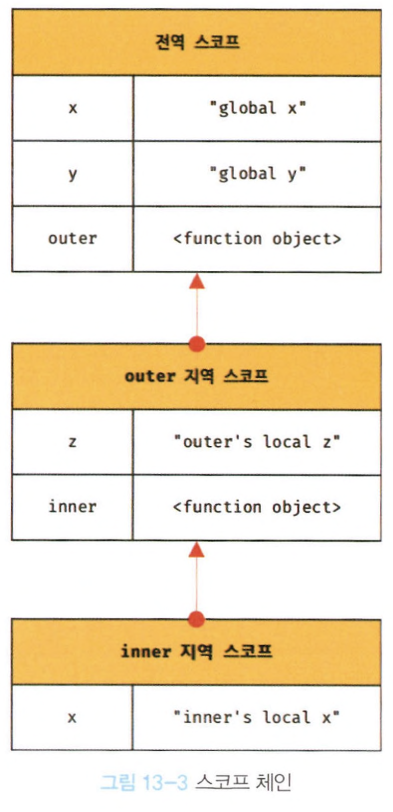

# 13장 스코프

## 스코프란?

모든 식별자는 자신이 선언한 위치에 의해 다른 코드가 식별자 자신을 참조할 수 있는 유효범위가 결정된다. 이 유효범위를 스코프라 한다.
-> **식별자가 유효한 범위**

**식별자 결정** : 이름이 같은 두 변수 중에서 어떤변수를 참조해야 할지 결정하는 것  
스코프는 `식별자를 검색할 때 사용하는 규칙`이라고 할 수 있다.

**렉시컬 환경 : 코드가 어디서 실행되며 주변에 어떤 코드가 있는지  
**코드의 문맥은 렉시컬 환경으로 이뤄진다.

\*\*식별자 : 어떤 값을 구별하여 식별해낼 수 있는 고유한 이름

## 스코프의 종류

전역 : 코드의 가장 바깥영역
지역 : 함수 몸체 내부

### 전역과 전역 스코프

- 전역은 전역 스코프를 만든다.
- 전역에 변수를 선언하면 전역 스코프를 갖는 전역변수가 된다.

### 지역과 지역 스코프

- 지역은 지역 스코프를 만든다.
- 지역에 변수를 선언하면 지역 스코프를 갖는 지역변수가 된다.
- 지역 변수는 자신의 지역스코프와 하위 지역 스코프에서 유효하다.

## 스코프 체인

함수는 중첩될 수 있으므로 스코프도 중첩될 수 있다.
스코프가 함수의 구조에 의해 **계층적 구조**를 갖는다.

- 모든 스코프는 계층적 구조를 갖는다.
- 스코프가 계층적으로 연결된 것을 **스코프 체인**이라 한다.
- 변수를 참조할 때 자바스크립트 엔진은 **스코프 체인**을 통해 변수를 참조하는 코드의 스코프에서 시작하여 상위 스코프 방향으로 이동하며 선언된 변수를 검색한다.

<div style="text-align: center;">
  
</div>

- 스코프 체인은 실행컨텍스트의 렉시켤환경을 단방향으로 연결한 것이다.

### 스코프 체인에 의한 변수 검색

- 스코프 체인에 따라 상위 스코프로 이동하며 선언된 변수를 검색한다.
- 상위 스코프에서 유효한 변수는 하위 스코프에서 자유롭게 참조할 수 있지만 하위 스코프에서 유효한 변수를 상위스코프에서는 참조할 수 없다.

### 스코프 체인에 의한 함수 검색

```jsx
//전역함수
function foo() {
  console.log("global foo");
}

function bar() {
  console.log("bar");
  //중첩함수
  function foo() {
    console.log("local foo");
  }
  foo();
}

bar();
```

- foo 함수를 호출한 코드에서는 먼저 함수를 가리키는 식별자 foo를 검색한다.
- 함수도 식별자에 해당되기 때문에 스코프를 갖는다.
- 스코프는 '식별자를 검색하는 규칙'이라는 말이 더 적합하다.

## 함수레벨 스코프

- 지역은 함수 몸체 내부를 말하므로 지역 스코프는 코드블록이 아닌 **함수에 의해서**만 생성된다.
- 대부분의 프로그래밍 언어는 코드블록(if, for, while ...)이 지역 스코프를 만든다. -> `블록레벨 스코프`
- var 키워드로 선언된 변수는 오로지 함수의 코드 블록만을 지역 스코프로 인정한다. -> `함수레벨 스코프`
- let, const 는 블록레벨 스코프를 지원한다.

## 렉시컬 스코프

상위스코프를 결정하는 두가지 패턴

> 1.  함수를 어디서 호출했는지에 따라 상위스코프 결정
> 2.  함수를 어디서 정의했는지에 따라 상위스코프 결정

- 첫번째 방식 -> 동적 스코프
- 두번째 방식 -> 렉시컬 스코프, 정적 스코프

자바스크립트를 비롯한 대부분의 언어는 **렉시컬 스코프**를 따른다.

- 함수를 어디서 호출했는지는 아무런 영향도 주지 않는다.
- 함수 정의가 실행되어 생성된 함수 객체는 결정된 상위 스코프를 기억한다.  
  (함수가 호출될때마다 함수의 상위 스코프를 참조할 필요가 있기 때문)
