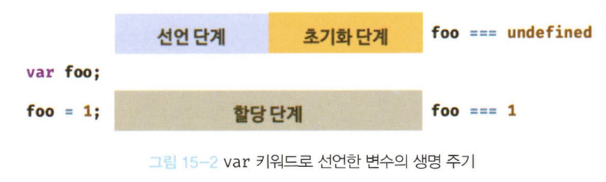
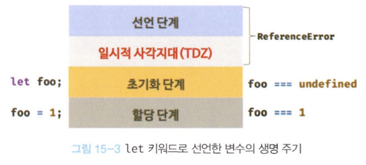

# 15장 let, const 키워드와 블록레벨 스코프

## var 키워드로 선언한 변수의 문제점

### 변수 중복 선언 허용

var 키워드로 선언한 변수는 중복 선언이 가능하다.  
이미 변수가 선언되었다는 것을 모르고 중복선언하며 값까지 할당했다면 의도치 않게 먼저 선언된 변수 값이 변경되는 부작용이 발생한다.

### 함수 레벨 스코프

- var 키워드로 선언한 변수는 오로지 함수의 코드블록만을 지역 스코프로 인정한다.
- for문에서 var 키워드로 선언한 변수도 전역변수가 된다.

### 변수 호이스팅

할당문 이전에 변수를 참조하면 언제나 undefined를 반환한다.

## let 키워드

var 키워드 단점을 보완하기 위해 새로운 변수 키워드 let, const를 도입했다.

### 변수 중복 선언 금지

let 키워드로 변수를 중복선언하면 **SyntaxError**가 발생한다.

### 블록 레벨 스코프

let으로 선언한 변수는 모든 코드 블록 (함수, if문, for문, while문, try/catch문 등)을 지역 스코프로 인정하는 블록 레벨 스코프를 따른다.

### 변수 호이스팅

var 키워드로 선언한 변수와 달리 let 키워드로 선언한 변수는 변수 호이스팅이 발생하지 않는 것처럼 동작한다.

```jsx
console.log(foo); //ReferenceError: foo is not defined
let foo;
```

참조 에러가 발생한다.

- var 키워드는 '선언단계', '초기화 단계'가 한번에 진행된다.
<div style="text-align: center;">
  
</div>

- let 키워드는 '선언단계', '초기화 단계'가 분리되어 진행된다.
- 런타임 이전에 암묵적으로 '선언 단계'가 먼저 실행되지만 '초기화 단계'는 변수 선언문에 도달했을때 실행된다.
<div style="text-align: center;">
  
</div>

스코프의 시작 지점 부터 초기화 시작 지점까지 변수를 참조할 수 없는 구간을 `일시적 사각지대(TDZ)`라고 한다.

\*\*let 키워드는 변수 호이스팅이 발생하지 않는것은 아니다.

```jsx
let foo = 1; //전역 변수
{
  console.log(foo); //ReferenceError
  let foo = 2;
}
```

let 키워드가 변수 호이스팅이 발생하지 않는다면 위에서는 전역변수 foo의 값을 출력해야하는데 그렇지 않기때문에 참조에러가 발생한다.

> ES6에서는 도입된 let, const를 포함해서 모든 선언(var, let, const, function, function\*, class)을 호이스팅한다.  
> 단, let, const, class만 호이스팅이 동작하지 않는 것처럼 동작한다.

### 전역 객체와 let

- var 키워드로 선언한 전역변수, 전역함수, 선언하지 않은 변수에 값을 할당한 암묵적 전역은 전역객체 window의 프로퍼티가 된다.
- window는 생략할 수 있다.

- let 키워드로 선언한 전역 변수는 전역 객체의 프로퍼티가 아니다. window.foo 와 같이 접근할 수 없다.

## const 키워드

const 키워드는 상수를 선언하기 위해 사용된다.

### 선언과 초기화

const 키워드로 선언한 변수는 반드시 선언과 동시에 초기화 해야한다. -> **SyntaxError 발생**

### 재할당 금지

var 또는 let 키워드로 선언한 변수는 재할당이 자유로우나 const 키워드로 선언한 변수는 **재할당이 금지** 된다.

### 상수

- const 키워드로 선언한 변수에 원시값을 할당한 경우 변수값을 변경할 수 없다. 원시값은 재할당없이 값을 변경할 수 없다.

- 상수는 재할당이 금지된 변수이다.

### const 키워드와 객체

const 키워드로 선언된 변수에 객체를 할당한 경우 값을 변경할 수 있다.  
(재할당 없이도 값 변경이 가능하기 때문)

const는 재할당을 금지할 뿐 '불변'을 의미하지는 않는다.

## var `vs` let `vs` const

변수선언에는 기본적으로 const를 사용하고 let 재할당이 필요한 경우에 한정해 사용하는 것이 좋다.

- ES6를 사용한다면 var 키워드는 사용하지 않는다.
- 재할당이 필요한 경우에 한정해 let 키워드를 사용한다. 이때 변수의 스코프는 최대한 좁게 만든다.
- 변경이 발생하지 않고 읽기 전용으로 사용하는 원시값과 객체에는 const 를 사용한다.
