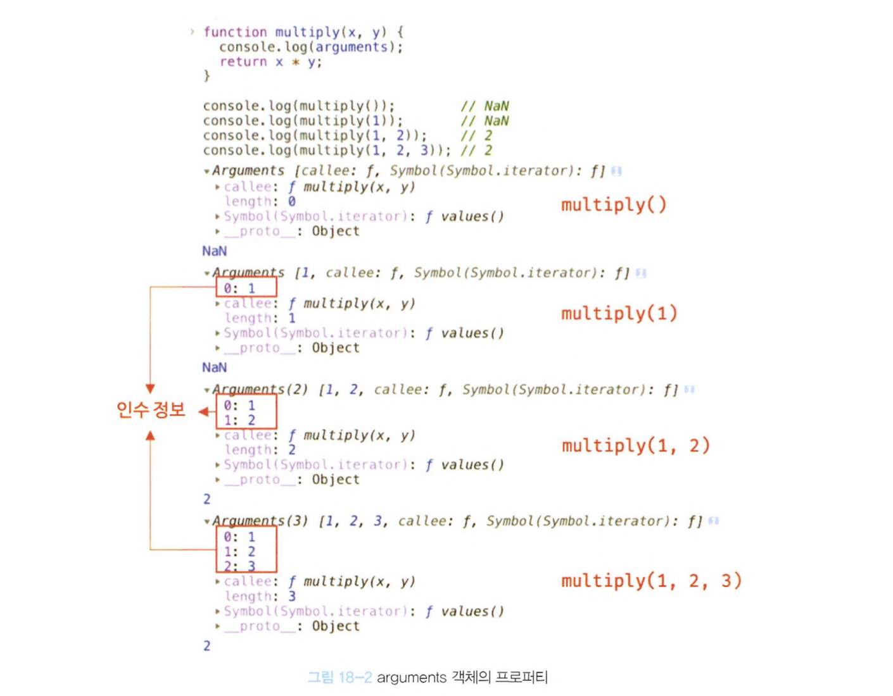

# 18장 함수와 일급 객체

## 일급 객체

일급 객체의 조건

- 무명의 리터럴로 생성할 수 있다. 즉, 런타임에 생성이 가능하다.
- 변수나 자료구조에 저장할 수 있다.
- 함수의 매개변수에 전달할 수 있다.
- 함수의 반환값으로 사용할 수 있다.

\***\*무명의 리터럴** : 이름이 붙지 않은 값 자체

ex)

```jsx
console.log(42); // 숫자 리터럴 42
console.log("Hello, world!"); // 문자열 리터럴 "Hello, world!"
console.log([1, 2, 3, 4]); // 배열 리터럴
console.log({ name: "Chaeyeong", age: 25 }); // 객체 리터럴
```

> 함수도 일급객체이다.  
> 함수와 일반객체와 다른 점은 호출할 수 있다는 점이다.

## 함수 객체의 프로퍼티

함수도 객체이므로 프로퍼티를 가질 수 있다.

<div style="text-align: center;">
  
</div>

<div style="text-align: center;">
  
</div>

arguments, caller, length, name, prototype 프로퍼티는 모두 함수 객체의 프로퍼티이며, 일반 객체에는 없는 함수 고유의 프로퍼티이다.

### arguments 프로퍼티

- arguments 프로퍼티 값은 arguments 객체다.
- arguments 객체는 함수 호출 시 전달된 인수들의 정보를 담고 있는 **순회 가능한 유사 배열 객체**이며 함수 내부에서 지역 변수 처럼 사용된다.
- Function.arguments와 같은 사용법은 권장되지 않으며 함수 내부에서 지역 변수처럼 사용할 수 있는 arguments 객체를 참조한다.

```jsx
function multiply(x, y) {
  console.log(arguments);
  return x + y;
}
```

- 함수를 호출할 때 선언된 매개변수보다 적게 전달하면 undefined 초과해서 전달하면 초과된 인수는 무시된다  
  -> 초과된 인수가 버려지는 것은 아니다. 암묵적으로 arguments 객체의 프로퍼티로 보관된다.

<div style="text-align: center;">
  
</div>

- arguments 객체는 매개변수 개수를 확정할 수 없는 **가변인자함수**를 구현할 때 유용하다.

```jsx
function sum() {
  let res = 0;

  for (let i = 0; i < arguments.length; i++) {
    res += arguments[i];
  }

  return res;
}
```

- arguments 객체는 실제 배열이 아닌 유사 배열 객체다.

\***\*유사 배열 객체** : length 프로퍼티를 가진 객체로 for 문으로 순회할 수 있는 객체를 말한다.

### caller 프로퍼티

- ECMAScript 사양에 포함되지 않은 비표준 프로퍼티
- 함수 객체의 caller 프로퍼티는 함수 자신을 호출한 함수를 가리킨다.

### length 프로퍼티

- 함수 객체의 length 프로퍼티는 함수를 정의할 때 선언한 매개변수의 개수를 가리킨다.
- arguments 객체의 length 프로퍼티는 인수의 개수를 가리킨다.

### name 프로퍼티

함수 이름 나타낸다.

### `__proto__` 접근자 프로퍼티

모든 객체는 [[Prototype]]이라는 내부 슬롯을 갖는다.  
[[Prototype]]이라는 내부 슬롯 : 상속을 구현하는 프로토타입 객체

`__proto__` 프로퍼티는 [[Prototype]] 내부 슬롯이 가리키는 프로토타입 객체에 접근하기 위해 사용하는 접근자 프로퍼티다.  
내부슬롯에 직접접근이 아니라 간접접근 방법을 제공하는 경우에 한하여 접근할 수 있다.

```jsx
const obj = { a: 1 };
console.log(obj.__proto__ === Object.prototype); //true

console.log(obj.hasOwnProperty("a")); //true
cossole.lof(obj.hasOwnProperty("__proto__")); //false
```

hasOwnProperty 메서드는 이름에서 알 수 있듯이 인수로 전달받은 프로퍼티 키가 객체 고유의 프로퍼티 키인 경우에만 true를 반환하고 상속받은 프로토타입의 프로퍼티 키인 경우 false를 반환한다.

### prototype 프로퍼티

prototype 프로퍼티는 생성자 함수로 호출할 수 있는 함수 객체, 즉 constructor만이 소유하는 프로퍼티다.  
non-constructor에는 prototype 프로퍼티가 없다.
