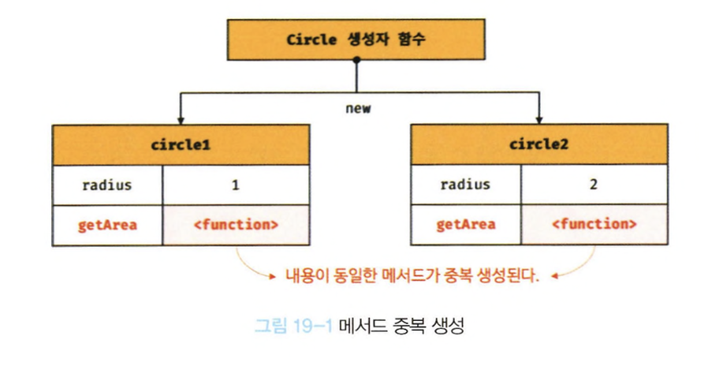
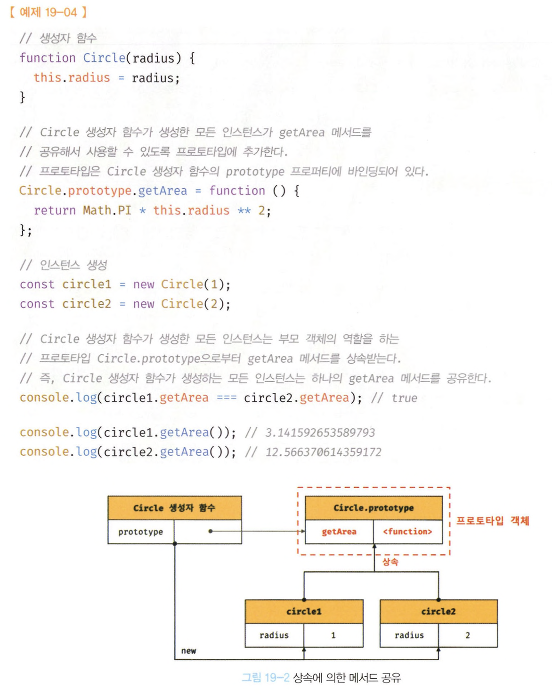
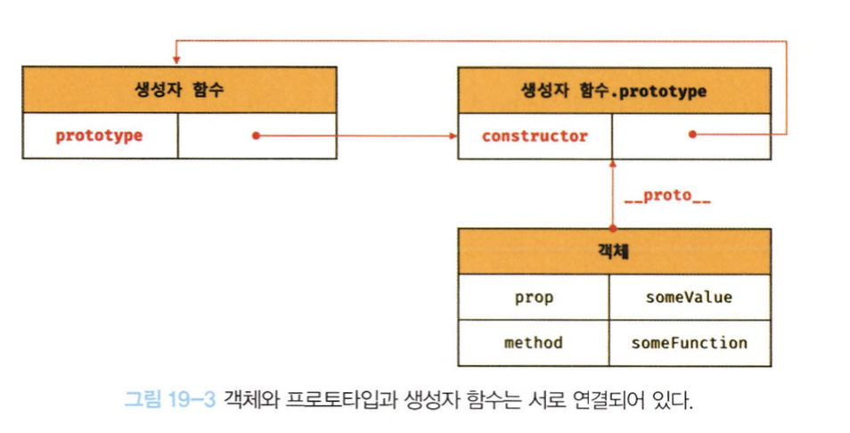
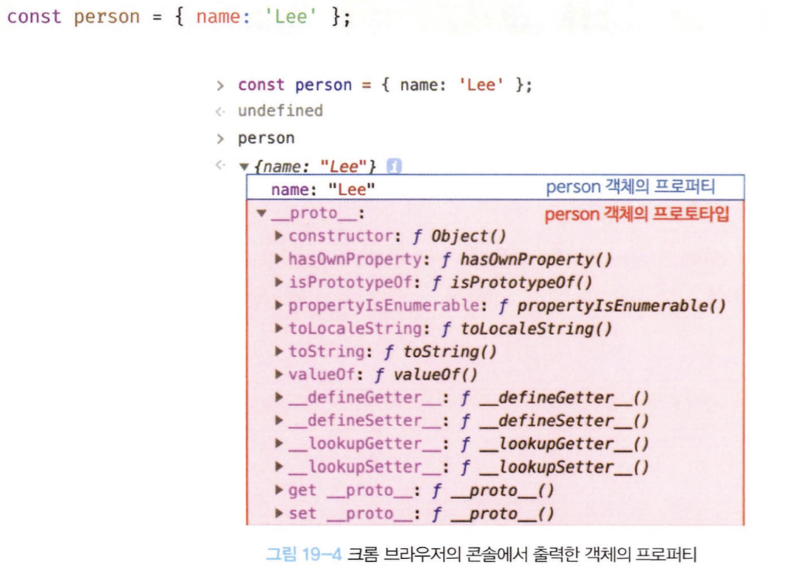
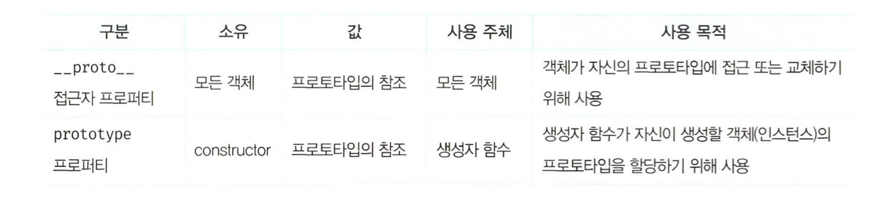
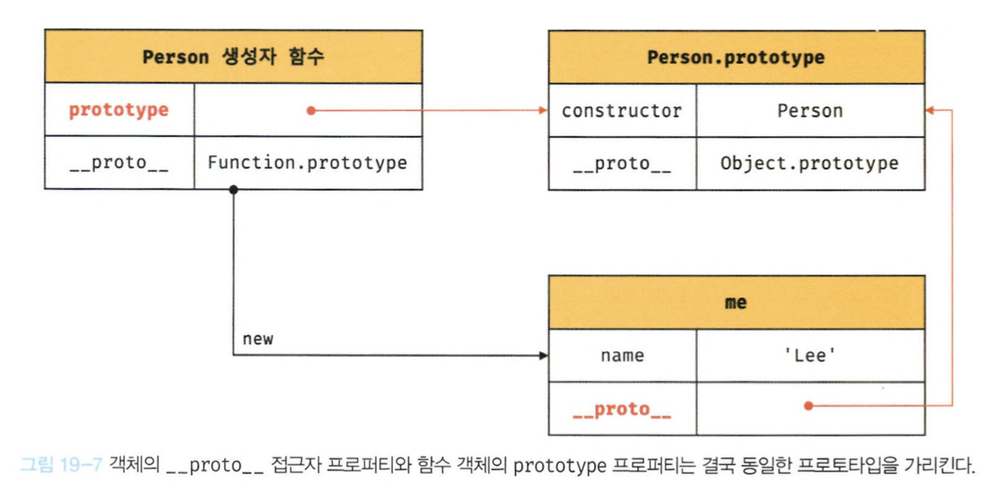
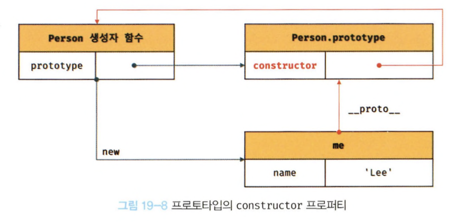

# 19장 프로토타입

자바스크립트는 명령형, 함수형, 프로토타입 기반 객체지향 프로그래밍을 지원하는 멀티 패러다임 프로그래밍 언어다.

## 객체지향 프로그래밍

- 여러 개의 독립적 단위, 즉 객체의 집합으로 프로그램을 표현하려는 프로그래밍 패러다임이다.
- 다양한 속성중에서 프로그램에 필요한 속성만 간추려 내어 표현하는 것을 추상화라고 한다.
- 속성을 통해 여러 개의 값을 하나의 단위로 구성한 복합적인 자료구조를 객체라한다.
- 객체는 상태 데이터와 동작을 하나의 논리적인 단위로 묶은 복합적인 자료구조이다.

## 상속과 프로토타입

상속 : 객체지향 프로그래밍의 핵심개념, 어떤 객체의 프로퍼티 또는 메서드를 다른 객체가 상속받아 그대로 사용하는 것

자바스크립트는 프로토타입을 기반으로 상속을 구현하여 불필요한 중복을 제거한다.

Circle이라는 생성자 함수가 존재할때 일반적으로 생성하면

<div style="text-align: center;">
  
</div>

인스턴스를 생성할 때마다 getArea 메서드를 중복 생성하고 모든 인스턴스가 중복 소유한다.  
이는 메모리를 불필요하게 낭비한다.

> 자바스크립트는 프로토타입을 기반으로 상속을 구현한다.

<div style="text-align: center;">
  
</div>

- Circle 의 생성자 함수가 생성한 모든 인스턴스는 자신의 프로토타입, 즉 상위(부모)객체 역할을 하는 Circl.prototype의 모든 프로퍼티와 메서드를 상속받는다.
- Circle 생성자 함수가 생성하는 모든 인스턴스는 getArea 메서드를 상속받아 사용할 수 있다.

> 상속은 재사용이란 관점에서 매우 유용하다.

## 프로토타입 객체

- 객체 간 상속을 구현하기 위해 사용된다.
- 모든 객체는 [[Prototype]]이라는 내부 슬롯을 가지며, 값은 프로토타입의 참조다.
- [[Prototype]]에 저장되는 프로토타입은 객체 생성 방식에 의해 결정된다.
- 모든 객체는 하나의 프로토타입을 갖는다.

<div style="text-align: center;">
  
</div>

- 내부 슬롯에는 직접 접근할 수는 없지만 `__proto__` 접근자 프로퍼티를 통해 자신의 프로토타입에 간접적으로 접근할 수 있다.

### `__proto__` 접근자 프로퍼티

모든 객체는 `__proto__`접근자 프로퍼티를 통해 자신의 프로토타입, 즉 [[Prototype]] 내부슬롯에 간접적으로 접근할 수 있다.

<div style="text-align: center;">
  
</div>

> #### `__proto__`는 접근자 프로퍼티다

- 접근자 프로퍼티는 자체적으로는 값([[Value]] 프로퍼티 어트리뷰트)을 갖지 않고 다른 데이터 프로퍼티의 값을 읽거나 저장할 때 사용하는 접근자 함수(accessor function), 즉 [[Get]], [[Set]] 프로퍼티 어트리뷰트로 구성된 프로퍼티다.

> #### `__proto__` 접근자 프로퍼티는 상속을 통해 사용된다.
>
> 접근자 프로퍼티는 객체가 직접 소유하는 프로퍼티가 아니라 Object.prototype의 프로퍼티다.  
> 모든 객체는 상속을 통해 Object.prototype.**proto**접근자 프로퍼티를 사용할 수 있다.

> #### `__proto__` 접근자 프로퍼티를 통해 프로토타입에 접근하는 이유

- 상호 참조에 의해 프로토타입 체인이 생성되는 것을 막기 위해서이다.
- 프로토타입 체인은 단방향 링크드 리스트로 구현되어야한다.
- 아무런 체크없이 무조건적으로 프로토타입을 교체할 수 없도록 접근자 프로퍼티를 통해 접근하고 교체하도록 구현되어 있다.

> #### `__proto__` 접근자 프로퍼티를 코드 내에서 직접 사용하는 것은 권장하지 않는다.

모든 객체가 `__proto__` 접근자 프로퍼티를 사용할 수 있는것이 아니기 때문이다.  
대신 Object.getPrototypeOf 메서드를 사용하고 교체하고 싶은 경우에는 Object.setPrototypeOf 메서드를 사용할 것을 권장한다.

### 함수 객체의 prototype 프로퍼티

- 함수 객체만이 소유하는 prototype 프로퍼티는 생성자 함수가 생성할 인스턴스의 프로토타입을 가리킨다.
- non-constructor 인 화살표 함수와 ES6메서드 축약표현으로 정의한 메서드는 prototype 프로퍼티를 소유하지 않으며 프로토타입도 생성하지 않는다.

> 모든 객체가 가지고 있는 `__proto__` 접근자 프로퍼티와 함수 객체만이 가지고 있는 prototype 프로퍼티는 결국 동일한 프로토타입을 가리킨다.

<div style="text-align: center;">
  
</div>

<div style="text-align: center;">
  
</div>

### 프로토타입의 constructor 프로퍼티와 생성자 함수

모든 프로토타입은 constructor 프로퍼티를 갖는다.  
이 construtor 프로퍼티는 prototype 프로퍼티로 자신을 참조하고 있는 생성자 함수를 가리킨다.

<div style="text-align: center;">
  
</div>

## 리터럴 표기법에 의해 생성된 객체의 생성자 함수와 프로토타입

constructor 프로퍼티가 가리키는 생성자 함수는 인스턴스를 생성한 생성자 함수다.

> 리터럴 표기법에 의한 객체 생성 방식과 같이 명시적으로 new 연산자와 함께 생성자 함수를 호출하여 인스턴스를 생성하지 않는 객체 생성 방식도 있다.

```jsx
//객체 리터럴
const obj = {};
//함수 리터럴
const add = function (a, b) {
  return a + b;
};
//배열 리터럴
const arr = [1, 2, 3];
//정규 표현식 리터럴
const regexp = /is/gi;
```

물론 프로토타입이 존재하지만, constructor 프로퍼티가 가리키는 생성자 함수가 반드시 객체를 생성한 생성자 함수라고 단정지을 수 없다.

```jsx
const obj = {};

console.log(obj.constructor === Object); // true
```

> 코드상 obj 객체는 Object 생성자 함수와 constructor 프로퍼티로 연결되어있는것처럼 보이지만  
> 결과적으로 객체리터럴에 의해 생성된 객체 Object 생성자 함수가 생성한 객체가 아니다. (프로퍼티 추가 처리 등 세부내용이 다름)
