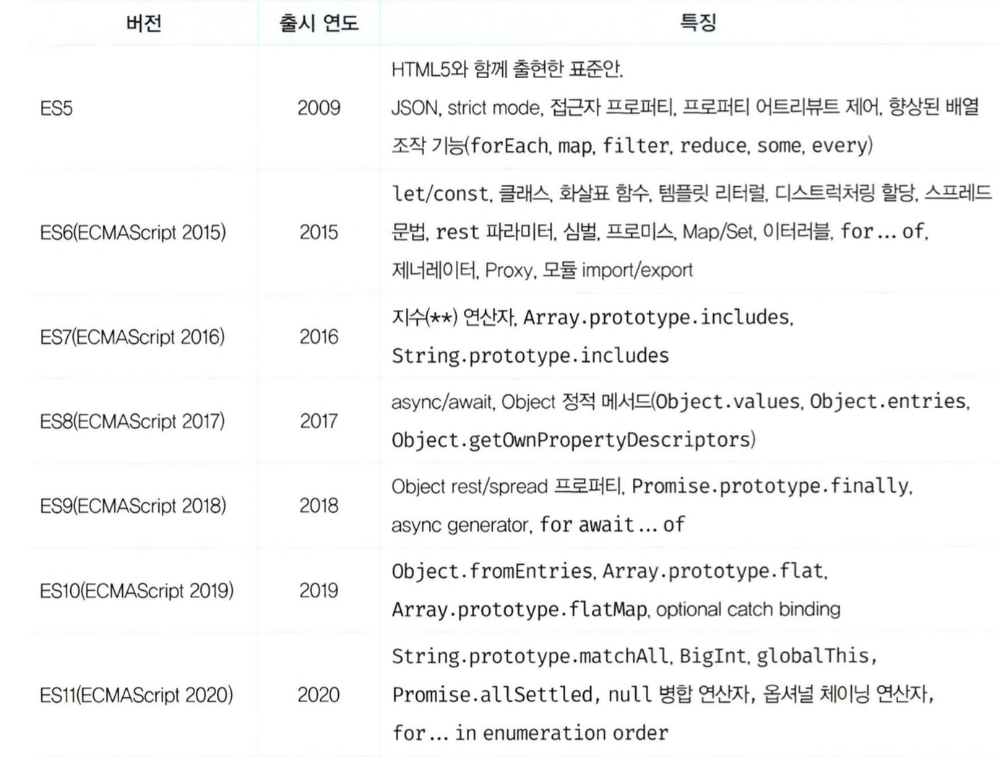
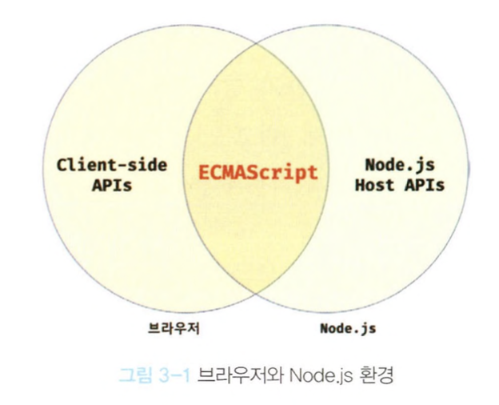
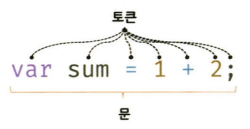
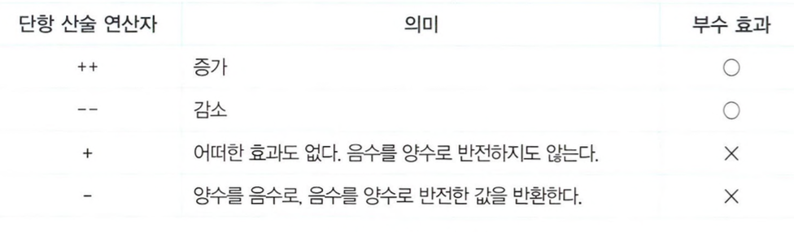
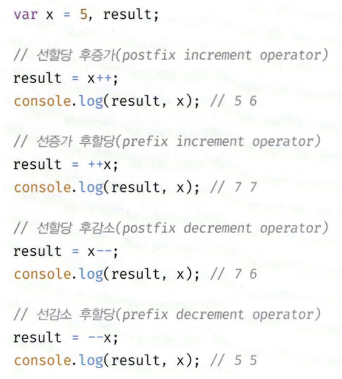
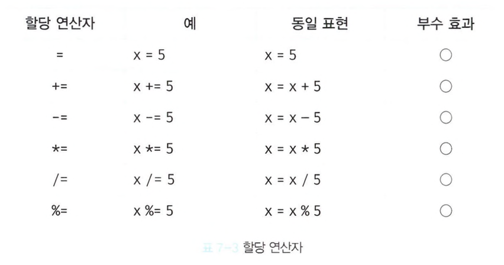
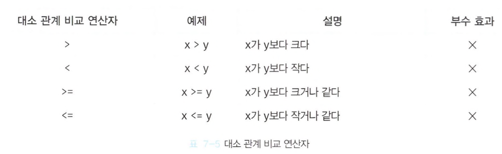
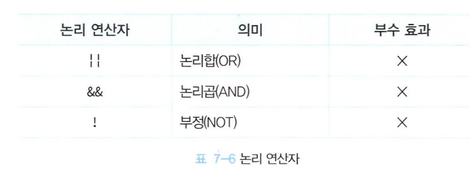

# 1장~8장

# 1장 프로그래밍

<aside>
💡

프로그래밍은 요구사항의 집합을 분석해서 적절한 자료구조와 함수의 집합으로 변환한 후, 그 흐름을 제어하는 것

</aside>

# 2장 자바스크립트란?

**\*크로스 브라우징 이슈**
다양한 웹 브라우저에서 웹사이트나 웹 애플리케이션이 일관되게 작동하고 보이는 것과 관련된 문제. 크로스 브라우징 이슈는 이러한 불일치를 해결하고, 모든 사용자에게 일관된 경험을 제공하기 위한 노력을 포함한다.

→ 자바스크립트 표준화 (ESMAScript/ES5,ES6)



## 자바스크립트 성장의 역사

### Ajax-XMLHttpRequest

- 자바스크립트를 이용해 서버와 브라우저가 **비동기 방식**으로 데이터를 교환할 수 있는 통신 기능
- 서버로부터 필요한 데이터만 전송받아 변경해야 하는 부분만 한정적으로 렌더링 하는 방식

### jquery

- 웹페이지 동작기능을 조작할 때 브라우저의 영향을 받지않고 원하는 기능 제작 가능
- DOM을 더욱 쉽게 제어할 수 있게 됨
- 크로스브라우징이슈 어느정도 해결

### V8 자바스크립트 엔진

- Google이 개발한 오픈소스로 가장 대중적인 자바스크립트 엔진
- C++로 개발하였고 Node JS 런타임 및 Chrome 브라우저에서 사용
- 이전의 자바스크립트 엔진은 인터프리터 방식으로 코드가 길어질수록 느려져 수행속도 개선을 위해 v8엔진 등장
- v8엔진은 인터프리터를 사용하는 대신 **`JIT(Just In Time)`** 컴파일러를 구현함으로써 코드 실행 시에 자바스크립트 코드를 머신 코드로 컴파일

\*자바스크립트 엔진
자바스크립트 코드를 **마이크로프로세서**가 이해할 수 있게 기계어로 변환해서 실행하는 **프로그램** 또는 **인터프리터**

\*JITC 컴파일러
JIT 컴파일 (just-in-time compilation) 또는 동적 번역 (dynamic translation)은 프로그램을 실제 실행하는 시점에 기계어로 번역하는 컴파일 기법. Just In Time Compiler로 프로파일링을 통해 최적화 할 코드를 선별한 후 해당 코드들만 컴파일합니다. 이 기법은 프로그램의 실행 속도를 빠르게 하기 위해 사용됨

### Node.js

- 자바스크립트 엔진에서만 동작하던 자바스크립트를 브라우저 이외의 환경에서도 동작할 수 있도록 브라우저에서 독립시킨 자바스크립트 실행환경
- 서버 사이드 애플리케이션에 주로 이용
- SPA에 적합
- CPU 사용률이 높은 애플리케이션에는 적합X

### SPA 프레임워크

- 단일 페이지 어플리케이션
- 필요한 데이터만 비동기로 받아와서 동적으로 현재 화면에 다시 렌더링 하는 방식
- 여러 페이지를 마치 하나의 페이지인 것처럼 처리하는 기술

## 자바스크립트와 ECMAScript

자바스크립트 = 클라이언트사이드 Web API + ECMAScript

\*클라이언트사이드 Web API
브라우저에 내장되어 있는 API로 브라우저를 이용해 복잡한 작업들을 쉽게 구현할 수 있도록 도와주는 API
DOM, BOM, Canvas, XMLHttpRequest, fetch, requestAnimation Frame, SVG, Web Storage, Web Component, Web Worker 등

- DOM → 브라우저에 로드된 문서를 제어, 조작
- BOM → 웹 브라우저 자체를 객체들로 표현하는 형식으로 뒤로가기 기능, URL이동 기능
- Canvas → 그래픽 요소들을 웹 페이지에 그리는데 도움
- XMLHttpRequest → 웹 페이지의 일부를 업데이트 하는데 도움

## 자바스크립트의 특징

- 웹 브라우저에서 동작하는 유일한 프로그래밍 언어
- 인터프리터 언어
- 프로토타입 기반의 객체지향 언어

# 3장 자바스크립트 개발 환경과 실행방법



### 개발자 도구


# 4장 변수

## 변수

자바스크립트는 개발자의 직접적인 메모리 제어를 허용하지 않기 때문에 하나의 값을 저장하기 위해 확보한 메모리 공간 자체 또는 그 메모리 공간을 식별하기 위해 붙인 이름인 `변수`를 이용한다.

→ 값의 위치를 가리키는 상징적인 이름, 개발자가 직접 메모리 주소를 통해 값을 저장하고 참조할 필요가 없고 변수를 통해 안전하게 값에 접근 가능

*할당: 변수에 값을 저장하는 것
*참조: 변수에 저장된 값을 읽어 들이는 것

## 식별자

어떤 값을 구별해서 식별할 수 있는 고유한 이름, 값이 아니라 메모리 주소를 기억

## 변수 선언

### var / let / const 키워드

<aside>
💡

var

var는 블록레벨스코드 대신 함수레벨스코프를 지원하기 때문에 의도치 않게 전역 변수가 선언되어 심각한 부작용이 발생하기도 함

이를 보완하기 위해 ES6에서 let 과 const를 도입했음

</aside>

### var

- 변수를 선언하고 변수에 값을 할당하지 않으면 자바스크립트 엔진에 의해 `undefined`라는 값이 암묵적으로 할당되어 초기화 됨
- 자바스크립트 엔진은 변수 선언을 **2단계 - 선언단계(변수이름등록), 초기화 단계(메모리공간확보, undefined 할당)**에 거쳐 수행
- 변수 이름을 비롯한 모든 식별자는 실행 컨텍스트에 등록
- 초기화를 거치지 않으면 이전에 사용했던 값이 남아 쓰레기값이 나올수 있는데 var는 undefined로 이를 방지함

## 변수 선언의 실행 시점과 변수 호이스팅

```jsx
console.log(score);
var score;
```

- 참조에러(ReferenceError)가 발생할 것 처럼 보이지만 발생하지 않고 undefined가 출력됨
- 자바스크립트 엔진은 소스코드 실행을 위한 준비단계인 소스코드 평가과정에서 변수선언을 포함한 모든 선언문을 소스코드에서 찾아 먼저 실행함
- **변수 선언문이 코드의 선두로 끌어 올려진 것처럼 동작하는 자바스크립트 고유의 특징
  (**변수뿐 아니라 키워드를 사용해서 선언하는 모든 식별자는 호이스팅됨**)
  → 변수 호이스팅**

## 값의 재할당

재할당 된 변수의 이전값들은 가비지 콜렉터에 의해 메모리에서 자동 해제 됨 \*가비지콜렉터
애플리케이션이 할당한 메모리 공간을 주기적으로 검사하여 더 이상 사용되지 않는 메모리를 해제하는 기능 → 메모리 누수 방지

## 식별자 네이밍 규칙

- 특수문자를 제외한 문자, 언더스코어, 달러 기호 포함 가능
- 숫자로 시작되는것은 허용되지 않음
- 예약어는 식별자로 사용될 수 없음
  
- 자바스크립트는 대소문자도 구별
- 네이밍 컨벤션
  - 카멜케이스 camelCase
  - 스네이크 케이스 snake_case
  - 파스칼 케이스 PascalCase
  - 헝가리언 케이스 typeHungarianCase
    

# 5장 표현식과 문

## 값

- 식이 평가되어 생성된 결과
- 값은 리터럴을 사용해 생성할 수 있음

## 리터럴

사람이 이해할 수 있는 문자 또는 약속된 기호를 사용해 값을 생성하는 표기법


## 표현식

```jsx
const assignedVariable = 2; //문장(Statement)

assignedVariable * 4; // 표현식(Expression)

assignedVariable * 10; // 표현식(Expression)

assignedVariable - 10; // 표현식(Expression)

100; // 표현식(Expression)

50 + 50; // 표현식(Expression)

assignedVariable; // 표현식(Expression)

square(); // 표현식(Expression) 함수 호출도 표현식
```

- 표현식은 값을 만들어 냄
- 반드시 상태를 바꿀 필요는 없음
- 리터럴도 표현식이라 할 수 있음

## 문

### 문

프로그램을 구성하는 기본 단위이자 최소 실행 단위

### 토큰

문법적인 의미를 가지며, 문법적으로 더 이상 나눌 수 없는 코드의 기본요소



```jsx
var x; // 표현식인 문
x = 1 + 2; // 표현식이 아닌 문

// 변수에 값을 할당했을때 가능하면 표현식인 문, 아니면 표현식이 아닌 문

x = 100; //할당문은 표현식인 문임
```

\*완료값
표현식이 아닌 문을 실행하면 undefined를 출력함 → 완료값
표현식인 문을 실행하면 평가된 값을 반환함

# 6장 데이터타입


### number

- 정수, 실수, 2진수, 8진수, 16진수, 리터럴 어느 것을 참조하든 모두 10진수로 해석됨
- 정수만을 위한 타입이 없고 모두 실수로 처리함
- Infinity, -Infinity, NaN 표현 가능

### 템플릿 리터럴

- 멀티라인 문자열, 표현식 삽입, 태그드 템플릿 등 문자열 처리 기능 제공
- ‘’, “” 대신 `` 을 사용해 표현
- 멀티라인 문자열(문자열 삽입)
  ```jsx
  //ES6 이전
  let name = "Hojun";
  let greeting = "Hello my name is " + name;
  //이후
  let name = "Hojun";
  const greeting = "Hello my name is ${name}";
  ```
- 표현식 삽입
  ```jsx
  //이전
  let a = 1;
  let b = 10;
  console.log("1 * 10 is " + a * b);
  //이후
  let a = 1;
  let b = 10;
  console.log(`1 * 10 is ${a * b}`);
  ```
- 여러줄 문자열
  ```jsx
  //이전
  let text =
    "Hello, \
  my name is Alberto \
  how are you?  ";
  //이후
  let text = `Hello, 
  my name is Alberto 
  how are you?`;
  ```

## null

- 변수에 값이 없다는 것을 의도적으로 명식할 때 사용
- null을 할당하는 것을 이전에 참조하던 값을 더 이상 참조하지 않겠다는 의미

## 심벌

- 외부에 노출 되지 않고 다른 값과 중복되지 않는 유일무이한 값
- Symbol 함수를 호출해 생성
- 이름이 충돌할 위험이 없는 객체의 유일한 프로퍼티 키를 만들기 위해 사용

https://it-eldorado.tistory.com/149

## 데이터타입의 필요성

- 값을 저장할때 확보해야하는 메모리 공간의 크기를 결정하기 위해
- 값을 참조할때 한번에 읽어들여야할 메모리공간의 크기를 결정하기 위해
- 메모리에서 읽어들인 2진수를 어떻게 해석할지 결정하기 위해

## 동적 타이핑

- 자바스크립트는 정적 타입 언어와 다르게 변수를 선언할 때 타입을 선언하지 않음
- 어떤 데이터 타입의 값이라도 자유롭게 할당 가능
- 선언이 아닌 할당에 의해 타입이 결정됨, 재할당에 의해 언제든지 타입 변경가능 → 동적타이핑

### 단점

- 변수값을 추적하기 어려움
- 유연성은 높지만 신뢰성은 떨어짐

# 7장 연산자

## 산술연산자






## 할당연산자



## 비교연산자




## 삼항조건연산자


## 논리연산자



## 연산자 우선순위


# 8장 제어문

조건문 / 반복문

## 조건문

### if … else 문

삼항 연산자로 변경가능

```jsx
if (num > 0) {
  result = "양수";
} else if (num < 0) {
  result = "음수";
} else {
  result = "영";
}

//삼항 연산자
var result = num ? (num > 0 ? "양수" : "음수") : "영";
```

### switch 문

## 반복문

### for 문

```jsx
//기본
for (let i = 0; i < 10; i++) {
  console.log(i);
}
//무한루프
for(;;){...}

//for ... in - 객체가 가진 속성을 반복
let foo = {
    name: "홍길동",
    age: 30,
    address: "제주도"
}

for(let key in foo) {
    console.log(key + " : " + foo[key]);
}
//for ... of - 반복가능한 객첵의 내용을 담아 반복
//반복 가능한 객체 : "배열, 문자열, Map, Set, arguments(함수의 인수)"
출처: https://offbyone.tistory.com/452 [쉬고 싶은 개발자:티스토리]
let arr = [ "foo", "bar", "baz" ];
for(let value of arr) {
    console.log(value);
}
```

### while 문

```jsx
// 0부터 4까지 5회 반복
let i = 0;
while(i < 5) {
    console.log("i = " + i);
    i++;
}

// 배열 인덱스로 사용하는 방법
let arr = [ "foo", "bar", "baz" ];
let i = 0;
while(i < arr.length) {
    console.log("arr["+i+"] = " + arr[i]);
    i++;
}

// 무한 루프
while(true) {
   ...
}
```

### do … while 문

```jsx
// 0부터 4까지 5회 반복
// 값을 1 증가시키는 ++ 연산자는 비교 평가후에 실행됩니다.
let i = 0;
do {
    console.log("i = " + i);
} while(i++ < 5);

// 빈 배열이면 arr[0] = undefined 출력.
let arr = [ "foo", "bar", "baz" ];
let i = 0;
do {
    console.log("arr["+i+"] = " + arr[i]);
} while(i++ + 1 < arr.length);

// 무한 루프가 됩니다.
do {
    ...
} while(true);
출처: https://offbyone.tistory.com/452 [쉬고 싶은 개발자:티스토리]
```

### 레이블 문

```jsx
// 블록에 붙인 예입니다.
markBlock: {
    console.log("블록 시작");

    // 레이블된 블럭을 빠져나갑니다.
    break markBlock;

    console.log("이 부분은 출력 안됨.");
}
console.log("블록 지나감");

결과)
블록 시작
블록 지나감

// 중첩 if 빠져나가기

// 바깥쪽 if 레이블
outerIf:
if(true) {
    // 안쪽 if 레이블
    innerIf:
    if(true) {
        // 바깥쪽 if를 바로 빠져나갑니다.
        break outerIf;
    }
    console.log("이곳은 출력되지 않습니다.");
}

console.log("완전 빠져나감.");
```

### break 문

### continue 문
