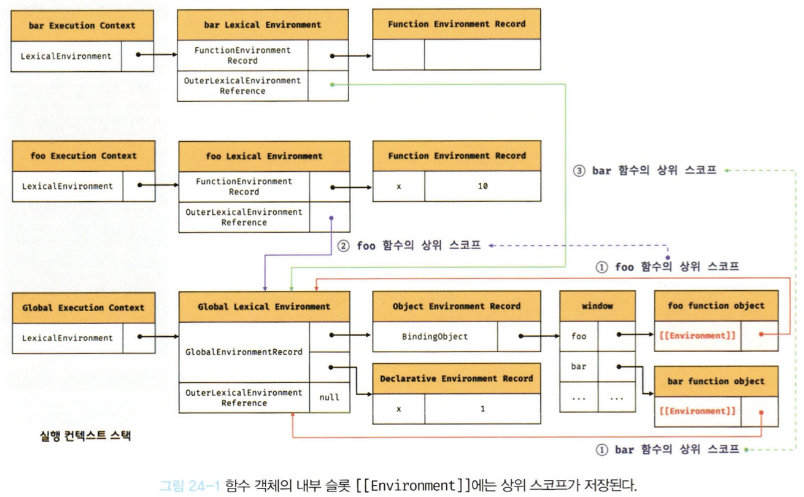

# 24장 클로저

## 렉시컬 스코프

자바스크립트 엔진은 어디서 함수가 호출됐는지가 아니라 **함수를 어디에 정의했는지**에 따라 상위 스코프를 결정한다.

- 스코프의 실체는 실행 컨텍스트의 렉시컬 환경이다.
- 렉시컬 환경은 자신의 외부 렉시컬 환경에 대한 참조(Outer Lexical Environment Reference)를 통해 상위 렉시컬 환경과 연결된다. -> **스코프 체인**

> 상위 스코프에대한 참조는 함수 정의가 평가되는 시점에 함수가 정의된 환경(위치)에 의해 결정된다. -> **렉시컬 스코프**

## 함수 객체의 내부슬롯 [[Environment]]

함수가 정의된 환경, 함수가 호출된 환경은 다를 수 있기 때문에 호출되는 환경과는 상관없이 자신의 상위스코프를 기억하고 있어야한다.

> 이를 위해 함수는 자신의 **내부 슬롯** [[Environment]]에 자신이 정의된 환경, 즉 상위 스코프의 참조를 저장한다.

- 함수객체의 내부슬롯에 저장된 현재 실행 중인 컨텍스트의 렉시컬 환경의 참조가 바로 상위 스코프다.
- 자신이 호출되었을때 생성될 함수 렉시컬 환경의 "외부 렉시컬 환경에 대한 참조"에 저장될 값이다.
- 함수 객체는 자신의 내부 슬롯에 저장한 렉시컬 환경의 참조, 즉 상위 스코프를 자신이 존재하는 한 기억한다.

```jsx
const x = 1;

function foo() {
  const x = 10;
  bar();
}

function bar() {
  console.log(x);
}

foo();
bar();
```

위 예제에서 foo 함수 내부에서 bar가 호출되어 실행중인 시점의 실행 컨텍스트

<div style="text-align: center;">
  
</div>
<p>

### 함수의 코드평가 순서

1. 함수 실행 컨텍스트 생성
2. 함수 렉시컬 환경 생성  
   2.1 함수 환경 레코드 생성  
   2.2 this 바인딩  
   2.3 외부 렉시컬 환경에 대한 참조 생성

> 외부 렉시컬 환경에 대한 참조에는 함수 객체의 내부 슬롯 [[Environment]]에 저장된 렉시컬 환경의 참조가 할당된다.

## 클로저와 렉시컬 환경

```jsx
const x = 1;
function outer() {
  const x = 10;
  const inner = function () {
    console.log(x);
  };
  return inner;
}
//outer 함수를 호출하면 inner함수를 반환한다.
// 그리고 outer의 실행컨텍스트는 실행 컨텍스트의 스택에서 제거된다.
const innerFunc = outer();
innerFunc(); // 10
```

- outer 함수를 호출하면 중첩함수 inner를 반환하고 생명주기를 마감한다.
- outer의 생명주기가 마감되었으므로 10을 저장하고 있던 지역변수 x의 생명주기도 마감된다. -> 달리 접근할 방법이 없어보인다
- 하지만 코드의 실행결과는 10이다.

> 중첩함수가 외부함수보다 더 오래 유지되는 경우 중첩함수는 이미 생명주기가 종료된 외부함수의 변수를 참조할 수 있다. 이러한 중첩 함수를 **클로저**라고 한다.

- 위 예제에서 inner 함수는 자신이 평가될 때 자신이 정의된 위치에 의해 결정된 상위스코프(outer함수의 렉시컬환경)를 [[Environment]] 내부 슬롯에 저장한다.
- outer 함수의 실행이 종료되면 inner함수를 반환하면서 outer 함수의 생명주기가 종료되고 실행컨텍스트가 스택에서 제거된다. 하지만 **outer함수의 렉시컬환경까지 사라지는 것은 아니다.**
- outer함수의 렉시컬 환경은 inner함수의 내부슬롯에서 참조되고 있고 inner 함수는 전역변수 innerFunc에 의해 참조되고 있기 때문에 가비지 콜렉션의 대상이 되지않는다.

> 자바스크립트의 모든 함수는 상위스코프를 기억하므로 클로저다.  
> 하지만 일반적으로 모든 함수를 클로저라고 하지는 않는다.  
> 상위스코프의 어떠한 식별자도 참조하지 않는 함수는 클로저가 아니다.
>
> **클로저는 중첩함수가 상위스코프의 식별자를 참조하고 있고 중첩함수가 외부함수보다 더 오래 유지되는 경우에 한정하는 것이 일반적이다.**

이론적으로 클로저는 상위스코프를 기억해야하므로 불필요한 메모리의 점유를 걱정할 수도 있지만 모던 자바스크립트 엔진은 최적화가 잘되어있어서 기억해야하는 식별자만 기억하기 때문에 걱정할 필요가 없다.

## 클로저의 활용

- 클로저는 상태(state)를 안전하게 변경하고 유지하기 위해 사용한다.
- 상태를 안전하게 은닉하고 특정함수에게만 상태 변경을 허용하기 위해 사용한다.

**예제** <함수가 호출될 때마다 호출된 횟수를 누적하여 출력하는 카운터>

```jsx
let num = 0;
const increase = function () {
  return ++num;
};
console.log(increase()); //1
console.log(increase()); //2
console.log(increase()); //3
```

위 코드는 잘동작하지만 오류를 발생시킬 가능성을 내포하는 코드다.

위코드가 동작하려면

1. 카운터의 상태는 함수가 호출되기 전에 변경되지 않아야한다.
2. 카운터 상태는 increase함수만이 변경할 수 있어야한다.

와 같은 전제조건이 성립되어야한다.

하지만 카운터 상태는 전역변수로 관리되고 있기 때문에 누구나 변경할 수 있고 접근할 수 있다. (암묵적 결합)

위를 해결하기 위해 num 을 increase의 지역변수로 바꾸면 함수가 호출될 때마다 초기화 되기 때문에 늘 1을 출력한다.

클로저를 이용하여 다시 작성해보자.

```jsx
const increase( function () {
    let num = 0
    return function () {
        return ++num;
    };

}());
console.log(increase()); //1
console.log(increase()); //2
console.log(increase()); //3
```

이와같이 클로저를 활용하여 코드를 바꾸면 의도되지않은 변경이 일어날 일도 없고, 지역변수가 되어 매번 초기화 되지도 않는다.

> 클로저는 상태가 의도치 않게 변경되지 않도록 안전하게 은닉하고 특정함수에게만 상태변경을 허용하여 상태를 안전하게 변경하고 유지하기 위해 사용한다.

### 생성자 함수로 표현한 출력 카운터 예제

```jsx
const Counter = (function () {
  let num = 0;

  function Counter() {}

  Counter.prototype.increase = function () {
    return ++num;
  };
  Counter.prototype.decrease = function () {
    return num > 0 ? --num : 0;
  };

  return Counter;
})();

const counter = new Counter();
console.log(counter.increase()); //1
console.log(counter.increase()); //2
console.log(counter.decrease()); //1
console.log(counter.decrease()); //0
```

## 캡슐화와 정보 은닉

**캡슐화?**

객체의 상태를 나타내는 프로퍼티와 프로퍼티를 참조하고 조작할 수 있는 동작인 메서드를 하나로 묶는 것을 말한다.

**정보은닉?**

캡슐화를 객체의 특정 프로퍼티나 메서드를 감출 목적으로 사용하는 것

- 자바스크립트는 public/private/protected같은 접근제한자를 제공하지 않는다.
- 자바스크립트의 모든 객체와 프로퍼티는 기본적으로 모두 외부에 공개되어있다.
- 패턴을 사용하면 접근 제한자를 제공하지 않는 자바스크립트에서도 정보은닉이 가능한 것처럼 보인다.
- 하지만 자바스크립트는 정보은닉을 완벽하게 지원하지는 않는다.
