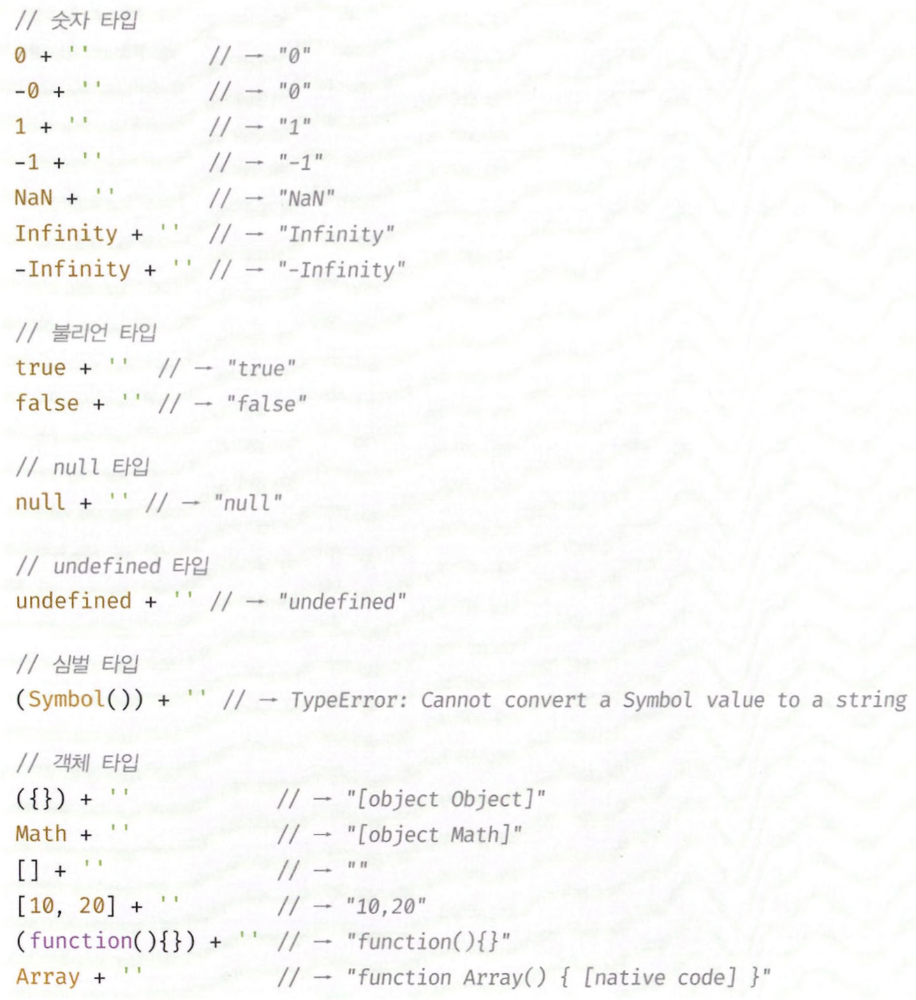
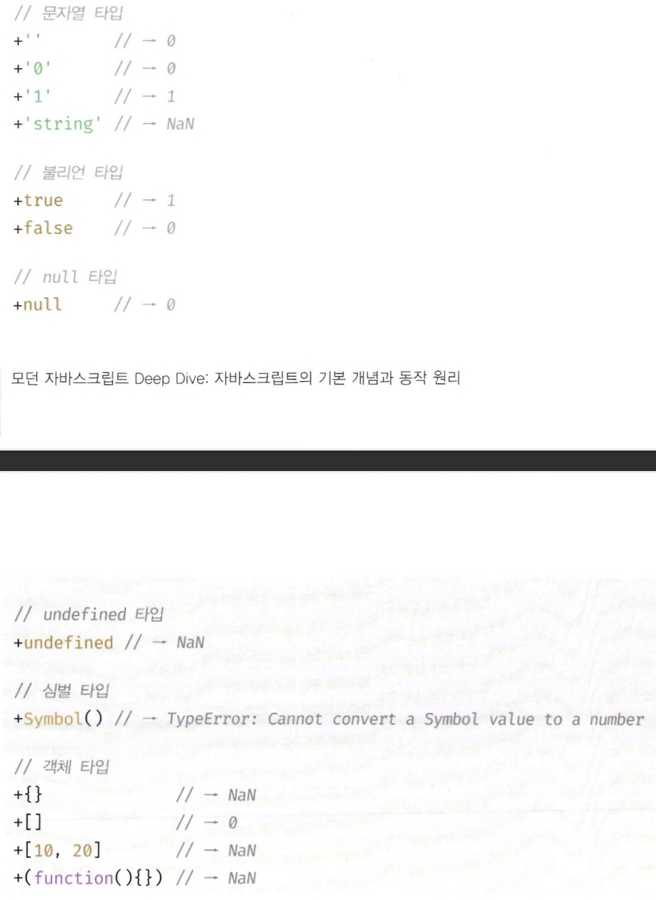
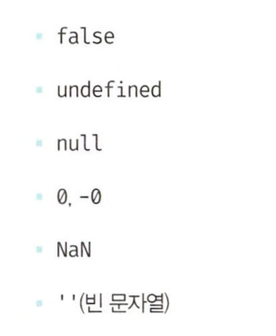
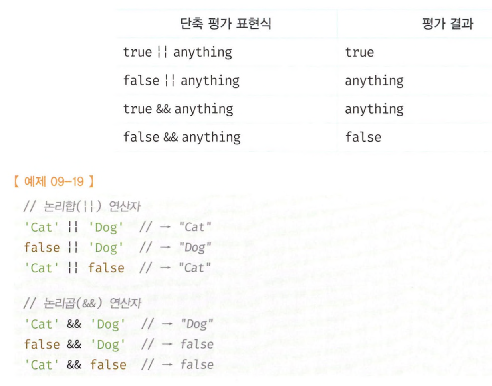
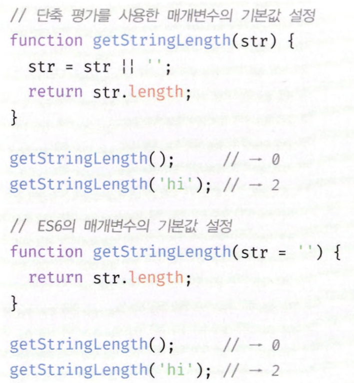
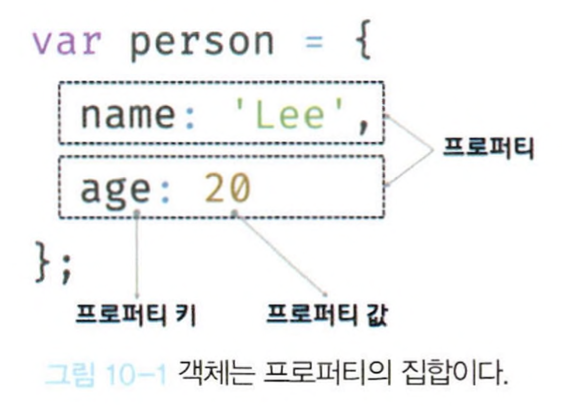
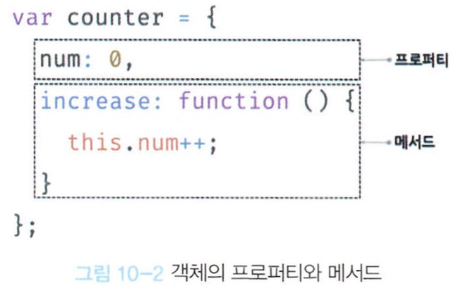
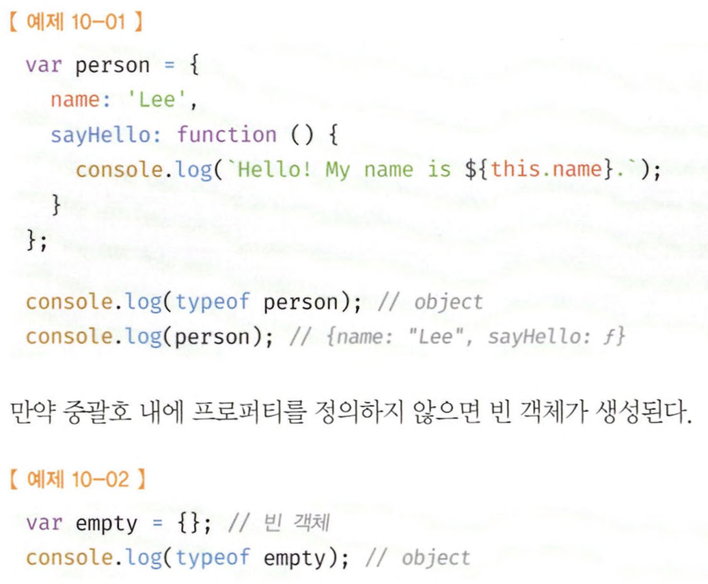

# 9장~11장

# 9장 타입 변환과 단축 평가

## 타입변환

**명시적 타입 변환, 타입 캐스팅**: 개발자가 의도적으로 값의 타입을 변환하는 것

`x.toString();`

**암묵적 타입 변환, 타입 강제 변환**: 개발자의 의도와 상관없이 표현식을 평가하는 도중에 자바스크립 엔진에 의해 암묵적으로 타입이 자동 변환 되는 것

`var x = 10;`

`var str = x + ‘’;`

\*\*기존 변수값을 재할당하여 변경하는 것이 아니라 암묵적 타입변환해 새로운 타입의 값을 만들어 한 번 사용하고 버린다.

## 암묵적 타입 변환

**예시**

`‘10’ + 2 → ‘102’`

`5 * ‘10’ → 50`

`!0 → true`

### 문자열 타입으로 변환

- ‘+’ 연산자는 피연산자 중 하나가 문자열이면 문자열 연결 연산자로 동작한다.
- 문자열 연결 연산자의 모든 피연산자는 코드의 문맥상 모두 문자열 타입이어야 한다 → 피연산자 중 문자열이 아닌것은 문자열 타입으로 암묵적 타입 변환을 한다.



### 숫자 타입으로 변환

- ‘-’ , ‘\*’ , ‘/’ 이 연산자들은 산술 연산자로 숫자 값을 만든다. → 산술연산자의 피연산자는 모두 숫자 타입이어야한다.
- 피연산자를 숫자 타입으로 변환할 수 없는 경우는 산술 연산을 수행할 수 없으므로 NaN 이 된다.
- ‘>’ 와 같은 비교연산자의 역할은 불리언 값을 만든다. → 모든 피연산자가 숫자타입이어야한다.
- ‘+’ 단항 연산자는 피연산자가 숫자타입이 아니면 암묵적 타입변환을 수행한다.
  예) `+’ ‘` → 0 `+’0’` → 0



### 불리언 타입으로 변환

- Falsy 값이 아닌 값들은 모두 true 로 평가되는 Truthy 값이다.



## 명시적 타입 변환

### 문자열 타입으로 변환

- `String(1)`
- `(1).toString();`
- `1 + ‘’;`

### 숫자타입으로 변환

- `Number(’0’);`
- `parseInt(’0’);`
- `parseFloat(’0’);`
- `+’0’;` //단항산술연산자 이용
- `‘0’*1;` //산술연산자 이용

### 불리언타입으로 변환

- `Boolean(’x’);`
- `!!’x’;`

### 단축평가

- 논리합(||), 논리곱(&&) 연산자 표현식은 2개의 피연산자 중 어느 한쪽으로 평가된다.
- 논리 연산의 결과를 결정하는 피연산자를 타입 변환하지 않고 그대로 반환한다.
- 표현식을 평가하는 도중에 평가 결과가 확정된 경우 나머지 평가 과정을 생략하는 것을 말한다.



- 단축평가를 사용하면 if 문을 대체할 수 있다.

```jsx
var done = true;
var message = "";

if (done) message = "완료";

message = done && "완료";
console.log(message);

var done = false;
var message = "";

if (!done) message = "미완료";

message = done || "미완료";
console.log(message);
```

\***\*단축평가가 유용하게 사용되는 경우**

- 객체를 가리키기를 기대하는 변수가 null or undefined가 아닌지 확인하고 프로퍼티를 참조할 때
  `var value = elem && elem.value;`
- 함수 매개변수에 기본값을 설정할 때
  

### 옵셔널 체이닝 연산자

옵셔널 체이닝 연산자 `.?` 은 좌항의 피연산자가 null 또는 undefined 인 경우 undefined를 반환하고, 그렇지 않으면 우항의 프로퍼티 참조를 이어간다.

- 논리연산자 &&는 좌항 피연산자가 Falsy값 이면 좌항의 피연산자를 그대로 반환한다.
- 옵셔널 체이닝 연산자는 좌항 피연산자가 Falsy값이어도 null 또는 undefined가 아니면 우항의 프로퍼티 참조를 이어간다.

### null 병합 연산자

null 병합 연산자 ?? 는 좌항의 피연산자가 null 또는 undefined인 경우 우항의 피연산자를 반환하고 그렇지 않으면 좌항의 피연산자를 반환한다.

`var foo = null ?? ‘default string’;`

# 10장 객체 리터럴

## 객체란?

- 자바스크립트를 구성하는 모든 것이 객체다.
- 원시타입은 단하나의 값만 나타내지만 객체타입은 다양한 타입의 값을 하나의 단위로 구성한 복잡한 자료구조이다.
- 원시값은 변경불가능, 객체는 변경가능한 값이다.
- 프로퍼티는 키와 값으로 구성된다.
  
- 프로퍼티 값이 함수인 경우 일반함수와 구분을 위해 메서드라 부른다.
  

## 객체 리터럴에 의한 객체 생성



- 객체 리터럴은 중괄호 내에 0개 이상의 프로퍼티를 정의한다.
- 변수에 할당되는 시점에 자바스크립트엔진은 객체 리터럴을 해석해 객체를 생성한다.
- 객체리터럴의 중괄호는 코드블록을 의미하지 않는다.

## 프로퍼티

객체는 프로퍼티의 집합이며, 프로퍼티는 키와 값으로 구성된다.

- 프로퍼티 키: 빈 문자열을 포함하는 모든 문자열을 또는 심벌 값
- 프로퍼티 값: 자바스크립트에서 사용할 수 있는 모든 값
- 식별자 네이밍 규칙을 따르면 ‘’가 생략가능하고 아니면 생략할 수 없다.
- 빈 문자열도 프로퍼티 키로 사용할 수 있다.

## 프로퍼티 접근

- 마침표 표기법
  `person.name`
- 대괄호 표기법
  `person[’name’]`
  \*\*대괄호 프로퍼티 접근 연산자 내부에 지정하는 프로퍼티 키는 반드시 따옴표로 감싼 문자열 이어야한다.


→ 두개의 에러가 다른이유는?

- 자바스크립트엔진은 먼저 person.last 를 평가하기 때문에 last라는 프로퍼티가 없으므로 undefined로 평가된다. 따라서 undefined-name이 되고 name은 식별자로 취급되므로 ReferenceError:name is not defined라는 에러가 발생한다.
- 브라우저에서는 name이라는 전역변수가 암묵적으로 존재한다. name은 창의 이름을 가리키며 기본값은 빈문자열이므로 undefined- ‘ ‘과 같으므로 NaN이 된다.

## 프로퍼티 값 갱신, 동적 생성, 삭제

- 이미 존재하는 프로퍼티에 값을 할당하면 프로퍼티 값이 갱신된다.
- 존재하지 않는 프로퍼티에 값을 할당하면 프로퍼티가 동적으로 생성되어 추가되고 프로퍼티 값이 된다.
- delete 연산자는 프로퍼티를 삭제한다.
  `delete person.age;`

## ES6에서 추가된 객체 리터럴의 확장 기능

### 프로퍼티 축약 표현

`const obj = {x,y};`

# 11장 원시 값과 객체의 비교

## 원시값

- 변경 불가능한 값
- 원시값 자체를 변경할 수 없다는 것이지 변수 값을 변경할 수 없다는 것은 아님
- 불변성으로 인해 값을 직접 변경할 수 없다 → 변수 값을 바꾸기 위해서는 원시값을 재할당하면 새로운 메모리 공간을 확보하고 재할당한 값을 저장한 후 변수가 참조하던 메모리 공간의 주소를 변경한다.
- **문자열 - 유사배열 객체**

## 값에 의한 전달

- 할당하는 변수에 할당되는 변수값이 복사되어 전달된다
- 자바스크립트에서는 엄밀히 말하면 값을 전달하는 것은 아니고 메모리를 전달하는 것이다

## 객체값

- 변경가능한 값
- 프로퍼티 개수가 정해져 있지 않으며 동적으로 추가, 삭제 될 수 있다
- 프로퍼티 값에도 제한이 없어 메모리 공간을 확보해 둘 수 없다
- 객체는 재할당 없이 객체를 직접 변경 할 수 있다.
- 재할당 없이 프로퍼티를 동적으로 추가, 변경할 수 있다
- 객체를 변경할 때 원시값과 같은 방식을 사용하면 메모리의 효율적 소비가 어렵고 성능이 나빠지기 때문에 변경가능한 값으로 설계됨
- `여러개의 식별자가 하나의 객체를 공유할 수 있음` - 단점

## 참조에 의한 전달

- 두개의 식별자가 같은 객체를 공유한다

→ 결과적으로는 자바스크립트는 값이냐, 참조값이냐의 차이만 있을 뿐 다 **값에 의한 전달** 이라고 할 수 있다
