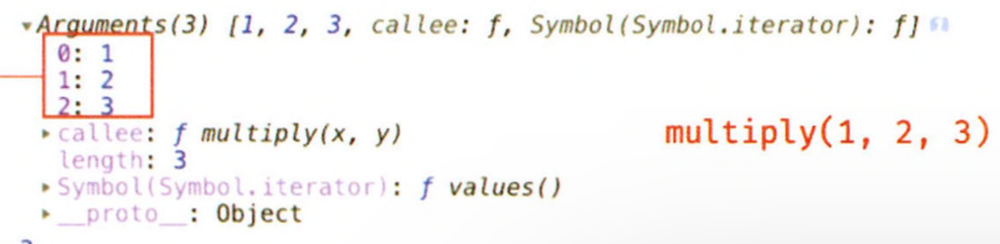

# 1️⃣8️⃣ 함수와 일급 객체

## 일급 객체

다음 조건을 만족하는 객체를 일급 객체라 한다.

1. 무명 리터럴로 생성할 수 있다. 즉, 런타임에 생성이 가능하다.
2. 변수나 자료구조(객체, 배열 등)에 저장할 수 있다.
3. 함수의 매개변수에 전달할 수 있다.
4. 함수의 반환값으로 사용할 수 있다.

=> 무명 리터럴이란 , const a = 1; 에서 a는 상수 1은 리터럴인데, a가 없는 1을 리터럴이라 하는 것 같다.

```
const a = 1; // 여기서 '1'은 리터럴, 'a'는 상수
console.log(1); // 여기서 '1'은 이름 없이 바로 사용된 무명 리터럴
```

✅ 함수가 일급 객체 라는 것은 함수를 객체와 동일하게 사용할 수 있다는 의미</br>
✅ 함수는 값을 사용할 수 있는 곳이라면 어디서든지 리터럴로 정의할 수 있으며 런타임에 함수 객체로 평가된다.

## 함수 객체의 프로퍼티

함수는 객체이다. 따라서 함수도 프로퍼티를 가질 수 있다.

### arguments 프로퍼티

함수 객체의 arguments 프로퍼티 값은 arguments 객체다. </br>
arguments 객체는 함수 호출 시 전달된 인수들의 정보를 담고 있는 순회 가능한 유사 배열 객체이며, 함수 내부에서 지역 변수처럼 사용됨</br>
**즉, 함수 외부에서는 참조할 수 없다.**

- 자바 스크립트는 함수의 매개변수와 인수의 개수가 일치하는지 확인하지 않는다.

```
function multiply(x,y){
    console.log(arguments);
    return x * y;
}

console.log(multiply()); // NaN
console.log(multiply(1)); //NaN
console.log(multiply(1,2)); // 2
console.log(multiply(1,2,3)); // 2 => 초과된 인수는 무시된다.
```

초과된 인수가 그냥 버려지는 것은 아님. 모든 인수는 암묵적으로 arguments 객체의 프로퍼티로 보관된다.


arguments 객체는 매개변수 개수를 확정할 수 없는 가변 인자 함수를 구현할 때 유용하다.

```
function sum(){
    for( let i =0 ;i < arguments.length ;i ++){
        res += arguments[i];
    }
    return res;
}

console.log(sum()) // 0
console.log(sum(1, 2)) // 3
console.log(sum(1, 2, 3)) // 6
```

### length 프로퍼티

함수 객체의 length 프로퍼티는 함수를 정의할 때 선언한 **매개변수의 개수**를 가리킨다.

```
function foo(){}
console.log(foo.length); // 0

function bar(x,y){
    return x * y ;
}
console.log(bar.length); // 2
```

### name 프로퍼티

함수 객체의 name 프로퍼티는 함수 이름을 나타낸다. (ES5와 ES6 동작다르게 적용)

```
var namedFunc = function foo() {};
console.log(namedFunc.name);  // foo

//익명 함수 표현식
var anonymousFunc = function(){};
console.log(anonymousFunc.name) // anonymousFunc
```

### **proto** 접근자 프로퍼티

모든 객체는 [[Prototype]] 이라는 내부 슬롯을 가진다. </br>
[[Prototype]] 내부 슬롯은 객체지향 프로그래밍의 상속을 구현하는 프로토타입 객체를 가르킨다. </br>

**proto** 프로퍼티는 [[Prototype]] 내부 슬롯이 가리키는 프로토타입 객체에 접근하기 위해 사용하는 접근자 프로퍼티다.

### prototype 프로퍼티

prototype 프로퍼티는 생성자 함수로 호출할 수 있는 함수 객체, 즉 constructor만이 소유하는 프로퍼티다.
일반 객체와 생성자 함수로 호출할 수 없는 non-constructor에는 prototype 프로퍼티가 없다.

```
// 함수 객체는 prototype 프로퍼티를 소유한다.
(function () {}).hasOwnProperty('prototype'); //true

//일반 객체는 prototype 프로퍼티를 소유하지 않는다.
({}).hasOwnProperty('prototype'); // false
```
