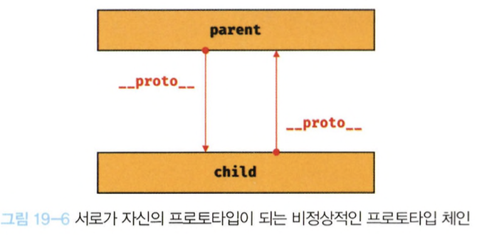
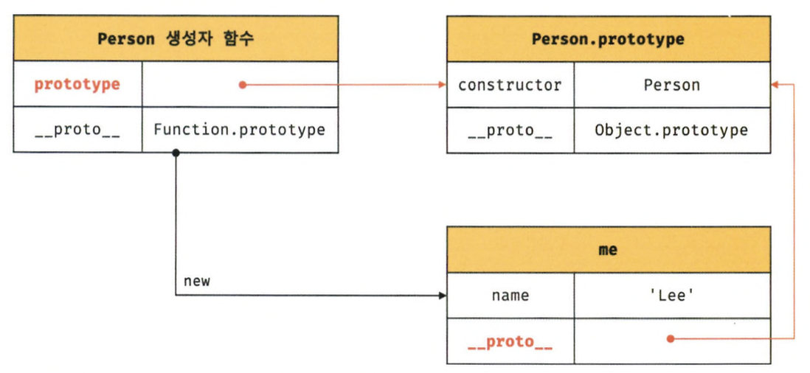
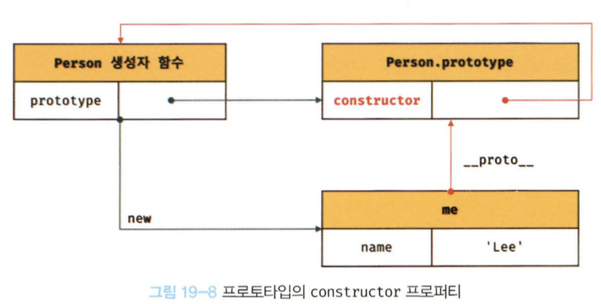

# 1️⃣9️⃣ 프로토타입

자바스크립트를 이루고 있는 거의 **모든 것**이 객체다.(원시 타입의 값을 제외한 나머지 값들은 모두 객체)

## 객체지향 프로그래밍

객체지향 프로그래밍은 프로그램을 여러 개의 독립된 단위인 객체들로 나누고, 이 객체들 간의 상호작용으로 프로그램을 구성하는 프로그래밍 패러다임이다.

객체지향 프로그래밍은 프로그램을 객체(Object)라는 기본 단위로 나누고, 객체 간의 상호작용을 통해 로직을 구성하는 방식이다.

- 추상화 : 필요한 속성만 간추려 내어 표현하는 것

## 상속과 프로토타입

어떤 객체의 프로퍼티나 메서드를 다른 객체가 상속받아 그대로 사용할 수 있는 것을 말한다.

자바스크립트는 프로토타입 기반의 객체지향 프로그래밍 언어이다. 자바스크립트의 모든 객체는 자신의 부모 역할을 하는 객체와 연결되어 있다. 이러한 부모 객체를 **프로토타입 객체** 또는 **프로토타입**이라고 한다.

## 프로토타입 객체

객체지향 프로그래밍의 근간을 이루는 객체 간 상속을 구현하기 위해 사용된다.
프로토타입 객체는 다른 객체에 공유 프로퍼티를 제공하기 위해 사용된다.

모든 객체는 자신의 프로토타입 객체를 가리키는 `[[Prototype]]`이라는 숨겨진 프로퍼티를 가진다. 이 프로퍼티는 객체 간 상속의 기초가 된다.

[[Prototype]] 내부 슬롯에는 직접 접근할 수 없지만, **proto** 접근자 프로퍼티를 통해 간접적으로 접근할 수 있다.

### **proto** 접근자 프로퍼티

모든 객체는 **proto** 접근자 프로퍼티를 통해 자신의 프로토타입 객체에 간접적으로 접근할 수 있다.

- **proto** 접근자 프로퍼티는 상속을 통해 사용된다.
  **proto** 접근자 프로퍼티는 객체가 직접 소유하는 프로퍼티가 아니라 Object.prototype 객체의 프로퍼티이다.

- **proto**접근자 프로퍼티를 통해 프로토타입에 접근하는 이유
  [[Prototype]] 내부 슬롯에 직접 접근할 수 없는 이유는 프로토타입은 객체의 일부가 아니라 객체와 연결된 링크의 역할을 하는 내부 슬롯이기 때문이다.

```javascript
const parent = {};
const child = {};

child.__proto__ = parent; // child의 프로토타입을 parent로 설정한다.

parent.__proto__ = child; // TypeError: Cyclic __proto__ value`
```



**프로토타입 체인은 단방향 링크드 리스트로 구현되어야 한다.** </br>
즉, 프로퍼티 검색 방향이 한쪽 반향으로만 흘러가야한다.

- **proto** 접근자 프로퍼티를 코드 내에서 직접 사용하는 것은 권장하지 않는다.
  - 모든 객체가 **proto** 접근자 프로퍼티를 사용할 수 있는 것은 아니기 때문
  - **proto** 접근자 프로퍼티는 비표준이다.
  - **proto** 접근자 프로퍼티는 호스트 객체에서 지원하지 않을 수 있다.

### 함수 객체의 prototype 프로퍼티

함수 객체만이 소유하는 prototype 프로퍼티는 생성자 함수가 생성할 인스턴스의 프로토타입을 가리킨다.

```javascript
//함수 객체는 prototype 프로퍼티를 소유한다.
(function () {}).hasOwnProperty("prototype"); // -> true

//일반 객체는 prototype 프로퍼티를 소유하지 않는다.
({}).hasOwnProperty("prototype"); // -> false
```

- 함수 객체가 생성자로 사용될 때, 이 함수를 통해 생성될 객체의 부모 역할을 하는 프로토타입 객체를 가리킨다.
- 함수 객체의 prototype 프로퍼티는 프로토타입 객체를 가리키며, 이 프로토타입 객체는 함수를 통해 생성될 객체의 부모 역할을 한다.

- 모든 객체가 가지고 있는 **proto** 접근자 프로퍼티와 함수 객체만이 가지고 있는 prototype 프로퍼티는 서로 다른 프로토타입을 가리킨다.

```javascript
function Person(name) {
  this.name = name;
}

const me = new Person("Lee");

// 모든 객체는 Object.prototype을 상속받는다.
console.log(me.hasOwnProperty("name")); // -> true
```



### 프로토타입의 constructor 프로퍼티와 생성자 함수

모든 프로토타입은 constructor 프로퍼티를 갖는다. 이 constructor 프로퍼티는 생성자 함수를 가리킨다.

```javascript
function Person(name) {
  this.name = name;
}

const me = new Person("Lee");

console.log(me.constructor === Person); // -> true
```



### 리터럴 표기법에 의해 생성된 객체의 생성된 함수와 프로토타입
