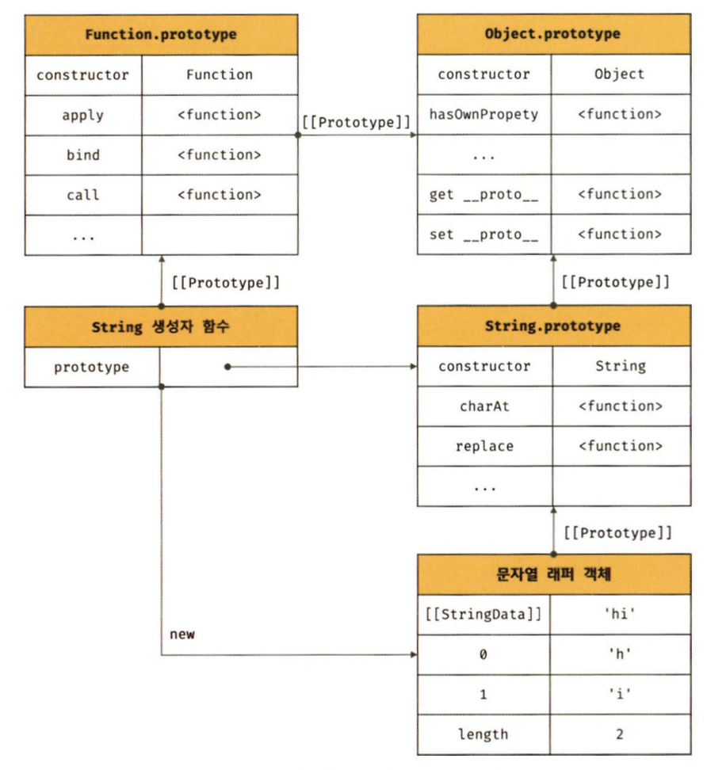

# 2️⃣1️⃣ 빌트인 객체

## 자바스크립트에서의 객체 분류

- 표준 빌트인 객체
  - ECMAScript 사양에 정의된 객체, 애플리케이션 전역 공통 기능 제공하여 자바스크립트 실행환경과 관계 없이 언제나 사용 가능
  - 별도의 선언 없이 전역 변수처럼 언제나 참조할 수 있다.
- 호스트 객체

  - ECMAScript 사양에 정의 X
  - **자바스크립트 실행환경에서 추가로 제공하는 객체**

- 사용자 정의 객체
  - 사용자 정의 객체는 표준 빌트인 객체와 호스트 객체처럼 기본 제공되는 객체가 아닌 **사용자가 직접 정의한 객체**

## 표준 빌트인 객체

인스턴스를 생성할 수 있는 생성자 함수 객체
Math. Reflect, JSON 제외한 모든 객체
프로토타입 메서드와 정적 메서드 제공
생성한 인스턴스의 프로토타입은 표준 빌트인 객체의 prototype 프로퍼티에 바인딩된 객체이다.

```
//String 생성자 함수에 의한 String 객체 생성
const strObj = new String('Lee');

//console.log(Object.getPrototypeOf(strObj) === String.prototype);
```

## 원시값과 래퍼 객체

표준 빌트인 생성자 함수가 존재하는 이유는 무엇일까?

```js
const str = "hello";

console.log(str.length); //5
console.log(str.toUpperCase()); //HELLO
```

➡️ 위와 같이 원시값은 객체가 아니므로 프로퍼티나 메서드를 가질 수 없는데도 원시값인 문자열이 마치 객체처럼 동작한다.

- 원시값을 마침표 또는 대괄호 표기법으로 접근하면 자바스크립트 엔진이 일시적으로 연관된 객체로 변환해 주기 때문이다.
  - 즉, 원시값을 객체처럼 사용하면 자바스크립트 엔진은 암묵적으로 연관된 객체로 변환해준다.

이처럼 원시값을 객체처럼 접근하면 생성되는 임시 객체를 래퍼 객체라 한다.(Wrapper Object)

- 예시

```js
const str = "hi";

// 원시 타입인 문자열이 래퍼객체인 String 인스턴스로  변환
console.log(str.length); //5
console.log(str.toUpperCase()); //HI

// 래퍼 객체로 프로퍼티에 접근하거나 메서드를 호출한 후, 다시 원시 값으로 되돌린다.
console.log(typeof str); //String
```



## 전역 객체

전역 객체는 코드가 실행되기 이전 단계에 자바스크립트 엔진에 의해 어떤 객체보다도 먼저 생성되는 특수한 객체이며, 어떤 객체에도 속하지 않는 최상위 객체다.

- JS 환경에 따라 이름 상이함
- 브라우저: window(or self, this, trames)
- Node.js: global
- 개발자가 의도적으로 생성할 수 X, 생성자 함수가 없다.
- 전역 객체의 프로퍼티를 참조할 때, window or global 생략 가능
- 브라우저 환경의 모든 JS 코드는 하나의 전역 객체를 공유

### 빌트인 전역 프로퍼티

전역 객체의 프로퍼티, 주로 애플리케이션 전역에서 사용하는 값을 제공

- Infinity
  - 무한대를 나타내는 숫자값
  - -Infinity 도 존재
- NaN
  - Not a Number, 숫자값 NaN을 갖는다.
  - Number.NaN 프로퍼티와 같다.
  - typeof NaN => number
- undefined
  - 원시타입 undefined를 값으로 갖는다

### 빌트인 전역 프로퍼티

애플리케이션 전역에서 호출할 수 있는 빌트인 함수로서 전역 객체의 메서드

- eval

  - 자바스크립트 코드를 나타내는 문자열을 인수로 받는다.
  - 전달받은 문자열 코드가 표현식이라면, 해당 코드를 런타임에 평가하여 값을 생성하고, 전달받은 인수가 표현식이 아니라 문이라면 해당 코드를 실행.
  - 여러개의 문이라면 모든 문 실행.

  ```js
  eval("1+2;"); //3

  eval("var x = 5;"); // undefined
  ```

  - JS 엔진에 의해 최적화 수행 X -> 처리 속도 느림
  - 사용 금지....

- IsFinite

  - 전달 받은 인수가 유한수인지 검사하여 불리언 타입 반환
  - 숫자로 자동 타입 변환 실행됨

- isNaN

  - 전달받은 인수가 NaN인지 검사 하여 불리언 타입 반환

- parseFloat

  - 전달받은 문자열 인수를 부동 소수점 숫자, 즉 실수로 해석하여 반환

- parseInt

  - 전달받은 문자열 인수를 정수로 해석하여 반환

- encodeURI / decodeURI

### 암묵적 전역

앞전에 했으니 생략 (stric mode에서 나옴)

- 간략이 말하면 선언이 되지 않는 변수가 선언이 된 전역 변수처럼 동작하는 것
- 전역 객체에 프로퍼티를 동적 생성.

```js
y = 20;

console.log(y);
에러 발생하여야 하는데 자바스크립트 엔진에 의해 y =20이 window.y = 20
전역 객체에 프로퍼티 동적 생성

```

이러한 현상으로 암묵적 전역이라고 한다. <br/>
전역 객체의 프로퍼티에 추가되었기에 y는 변수가 아니므로 변수 호이스팅 발생 X <br/>

- 암묵적 전역은, 변수가 아니라 프로퍼티이기에 delete로 삭제 가능
- 전역 변수는 변수이면서 프로퍼티이기에 delete로 삭제 불가
