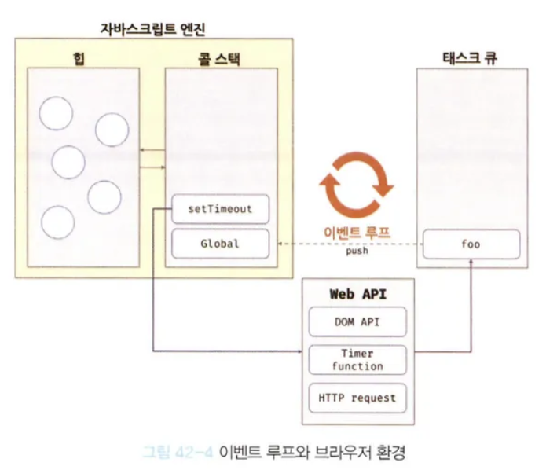

# 자바스크립트의 비동기 처리

## 실행 컨텍스트 스택

**자바스크립트 엔진은 단 하나의 실행 컨텍스트 스택을 갖는다**

- 함수를 실행할 수 있는 창구가 단 하나
- 동시에 2개 이상의 함수를 동시에 실행할 수 없음
- 한 번에 하나만 처리할 수 있기 때문에 처리 시간이 걸리는 태스크인 경우 **블로킹이 발생**

실행 컨텍스트 스택의 최상위 요소인 **실행 중인 실행 컨텍스트를 제외한 모든 실행 컨텍스트는 모두 실행 대기 중인 태스크들**이다.

대기 중인 태스크들은 현재 실행 중인 실행 컨텍스트가 pop되어 실행 컨텍스트 스택에서 제거되면, 즉 현재 실행 중인 함수가 종료하면 실행된다.

```javascript
// 해당 예제는 3초 경과 후 foo가 호출되고, bar가 호출되게끔 하려 함
function sleep(func, delay) {
  const delayUntil = Date.now() + delay;

  // 현재 시간이 딜레이 시간보다 작을 동안 루프를 돌다가 끝나면 func() 동작
  while (Date.now() < delayUntil);
  func();
}

function foo() {
  console.log("foo");
}

function bar() {
  console.log("bar");
}

// 3초 후 foo가 실행되고 난 뒤 bar 함수가 실행된다
sleep(foo, 3 * 1000);
bar();
```

## 동기 처리 방식

> 현재 실행 중인 태스크가 종료할 때까지 다음에 실행될 태스크가 대기하는 방식

**장점**

- 태스크를 순서대로 하나씩 처리하기 때문에 실행 순서가 보장됨

**단점**

- 앞선 태스크가 종료할 때까지 이후 태스크들이 블로킹됨

## 비동기 처리 방식

```javascript
function foo() {
  console.log("foo");
}

function bar() {
  console.log("bar");
}

// setTimeout 함수는 3초 후에 실행되는 것이 맞지만,
// setTimeout 함수 이후의 태스크를 블로킹하지 않고 곧바로 실행한다
setTimeout(foo, 3 * 1000);
bar();
```

> 현재 실행 중인 태스크가 종료되지 않은 상태라 해도 다음 태스크를 곧바로 실행하는 방식

**장점**

- 현재 실행 중인 태스크가 종료되지 않은 상태라 해도 다음 태스크를 곧바로 실행하므로 블로킹이 발생하지 않음

**단점**

- 태스크의 실행 순서가 보장되지 않음

**비동기 처리를 수행하는 비동기 함수는 콜백 패턴을 사용한다**

- 이러한 콜백 패턴은 콜백 헬을 발생시켜 가독성을 나쁘게 함
- 비동기 처리 중 발생한 에러의 예외 처리가 곤란하고, 여러 개의 비동기 처리를 한번에 처리하는 데도 한계가 있음

**비동기 처리 방식으로 동작하는 함수들**

- `setTimeout`, `setInterval`
- HTTP 요청
- 이벤트 핸들러

---

## 이벤트 루프와 태스크 큐

**자바스크립트의 동시성을 지원하는 것 → 이벤트 루프** (이벤트 루프는 브라우저에 내장되어 있는 기능)

### 자바스크립트 엔진의 구조

자바스크립트 엔진은 크게 두 영역으로 나뉜다.

**콜 스택 (Call Stack)**

- 실행 컨텍스트 스택
- 함수를 호출하면 함수 실행 컨텍스트가 순차적으로 콜 스택에 push되어 순차적으로 실행됨

**힙 (Heap)**

- 객체가 저장되는 메모리 공간
- 콜 스택의 실행 컨텍스트는 힙에 저장된 객체를 참조함

### 브라우저 환경이 제공하는 것들



**태스크 큐 (Task Queue)**

- 비동기 함수의 콜백 함수 또는 이벤트 핸들러가 일시적으로 보관되는 영역
- 태스크 큐와는 별도로 프로미스의 후속 처리 메서드의 콜백 함수가 일시적으로 보관되는 **마이크로태스크 큐**도 존재

**이벤트 루프 (Event Loop)**

- 콜 스택에 현재 실행 중인 실행 컨텍스트가 있는지, 그리고 태스크 큐에 대기 중인 함수가 있는지 반복해서 확인
- 만약 콜 스택이 비어 있고 태스크 큐에 대기 중인 함수가 있다면, 이벤트 루프는 순차적으로 태스크 큐에 대기 중인 함수를 콜 스택으로 이동시킴
- 이때 콜 스택으로 이동한 함수는 실행됨
- 즉, 태스크 큐에 일시 보관된 함수들은 비동기 처리 방식으로 동작

**백그라운드 (Background / Web API)**

- 별도 프로세스로 I/O 처리 후 콜백 함수를 태스크 큐로 전달

### 핵심 정리

비동기 처리에서 소스코드의 평가와 실행을 제외한 모든 처리는 자바스크립트 엔진을 구동하는 환경인 **브라우저 또는 Node.js가 담당**한다.

예를 들어:

- `setTimeout`의 콜백 함수의 평가와 실행 → **자바스크립트 엔진**이 담당
- 호출 스케줄링을 위한 타이머 설정과 콜백 함수 등록 → **브라우저 또는 Node.js**가 담당

이를 위해 브라우저 환경은 **태스크 큐**와 **이벤트 루프**를 제공한다.

### 동작 흐름

```
1. 비동기 함수 호출 (예: setTimeout)
   ↓
2. Web API/Background로 위임
   ↓
3. 타이머 완료 후 콜백 함수를 Task Queue에 추가
   ↓
4. Event Loop가 Call Stack이 비어있는지 확인
   ↓
5. Call Stack이 비면 Task Queue의 콜백을 Call Stack으로 이동
   ↓
6. 콜백 함수 실행
```

## setTimeout(0)의 동작 원리

이처럼 비동기 함수인 `setTimeout`의 콜백 함수는 태스크 큐에 푸시되어 대기하다가 콜 스택이 비게 되면, 다시 말해 전역 코드 및 명시적으로 호출된 함수가 모두 종료하면 비로소 콜 스택에 푸시되어 실행된다.

자바스크립트는 싱글 스레드 방식으로 동작한다. 이때 싱글 스레드 방식으로 동작하는 것은 브라우저가 아니라 **브라우저에 내장된 자바스크립트 엔진**이라는 것에 주의하기 바란다. 만약 모든 자바스크립트 코드가 자바스크립트 엔진에서 싱글 스레드 방식으로 동작한다면 자바스크립트는 비동기로 동작할 수 없다. 즉, 자바스크립트 엔진은 싱글 스레드로 동작하지만 **브라우저는 멀티 스레드로 동작**한다.

### 예제 코드

```javascript
function foo() {
  console.log("foo");
}

function bar() {
  console.log("bar");
}

setTimeout(foo, 0);
bar();
```

### 실행 과정

1. **전역 코드 평가**

   - 전역 코드가 평가되어 전역 실행 컨텍스트가 생성되고 콜 스택에 푸시된다

2. **setTimeout 함수 호출**

   - 전역 코드가 실행되기 시작하여 `setTimeout` 함수가 호출된다
   - 이때 `setTimeout` 함수의 함수 실행 컨텍스트가 생성되고 콜 스택에 푸시되어 현재 실행 중인 실행 컨텍스트가 된다
   - 브라우저의 Web API인 타이머 함수도 함수이므로 함수 실행 컨텍스트를 생성한다

3. **setTimeout 함수 종료**

   - `setTimeout` 함수가 실행되면 콜백 함수를 호출 스케줄링하고 종료되어 콜 스택에서 pop된다
   - 이때 호출 스케줄링, 즉 타이머 설정과 타이머가 만료되면 콜백 함수를 태스크 큐에 푸시하는 것은 **브라우저의 역할**이다

4. **병행 처리**

   - 브라우저가 수행하는 작업(a)과 자바스크립트 엔진이 수행하는 작업(b)은 병행 처리된다

   **a) 브라우저의 작업 (백그라운드)**

   - 브라우저는 타이머를 설정하고 타이머 만료를 기다린다
   - 이후 타이머가 만료되면 콜백 함수 `foo`가 태스크 큐에 푸시된다
   - 위 예제는 지연 시간이 0이지만 지연 시간이 4ms 이하인 경우 최소 지연 시간 4ms가 지정된다
   - 따라서 4ms 후에 콜백 함수 `foo`가 태스크 큐에 푸시되어 대기하게 된다
   - 이 처리 또한 자바스크립트 엔진이 아니라 **브라우저가 수행**한다
   - 이처럼 `setTimeout` 함수로 호출 스케줄링한 콜백 함수는 **정확히 지연 시간 후에 호출된다는 보장은 없다**
   - 지연 시간 이후에 콜백 함수가 태스크 큐에 푸시되어 대기하게 되지만 콜 스택이 비어야 호출되므로 약간의 시간차가 발생할 수 있기 때문이다

   **b) 자바스크립트 엔진의 작업 (콜 스택)**

   - `bar` 함수가 호출되어 `bar` 함수의 함수 실행 컨텍스트가 생성되고 콜 스택에 푸시되어 현재 실행 중인 실행 컨텍스트가 된다
   - 이후 `bar` 함수가 종료되어 콜 스택에서 pop된다
   - 이때 브라우저가 타이머를 설정한 후 4ms가 경과했다면 `foo` 함수는 아직 태스크 큐에서 대기 중이다

5. **전역 실행 컨텍스트 종료**

   - 전역 코드 실행이 종료되고 전역 실행 컨텍스트가 콜 스택에서 pop된다
   - 이로써 콜 스택에는 아무런 실행 컨텍스트도 존재하지 않게 된다

6. **이벤트 루프에 의한 콜백 실행**
   - 이벤트 루프에 의해 콜 스택이 비어 있음이 감지되고 태스크 큐에서 대기 중인 콜백 함수 `foo`가 이벤트 루프에 의해 콜 스택에 푸시된다
   - 다시 말해, 콜백 함수 `foo`의 함수 실행 컨텍스트가 생성되고 콜 스택에 푸시되어 현재 실행 중인 실행 컨텍스트가 된다
   - 이후 `foo` 함수가 종료되어 콜 스택에서 pop된다

### 핵심 정리

```
실행 순서: bar → foo (4ms 후)

1. setTimeout(foo, 0) 호출
   ↓
2. Web API로 타이머 위임 (최소 4ms)
   ↓
3. bar() 실행 (콘솔에 "bar" 출력)
   ↓
4. 전역 코드 종료 (콜 스택 비움)
   ↓
5. 4ms 후 foo가 Task Queue에 추가
   ↓
6. Event Loop가 foo를 Call Stack으로 이동
   ↓
7. foo() 실행 (콘솔에 "foo" 출력)
```

**포인트**

- `setTimeout(fn, 0)`이라도 최소 4ms의 지연이 발생한다
- 콜백 함수는 콜 스택이 완전히 비어야만 실행된다
- 따라서 지정한 지연 시간은 "최소 대기 시간"이지 "정확한 실행 시간"이 아니다
